---
## Front matter
title: "Отчёт по лабораторной работе №5"
subtitle: "*Дисциплина: Архитектура компьютера*"
author: "Долгаев Евгений Сергеевич НММбд-01-24"

## Generic otions
lang: ru-RU
toc-title: "Содержание"

## Bibliography
bibliography: bib/cite.bib
csl: pandoc/csl/gost-r-7-0-5-2008-numeric.csl

## Pdf output format
toc: true # Table of contents
toc-depth: 2
lof: true # List of figures
lot: true # List of tables
fontsize: 12pt
linestretch: 1.5
papersize: a4
documentclass: scrreprt
## I18n polyglossia
polyglossia-lang:
  name: russian
  options:
	- spelling=modern
	- babelshorthands=true
polyglossia-otherlangs:
  name: english
## I18n babel
babel-lang: russian
babel-otherlangs: english
## Fonts
mainfont: IBM Plex Serif
romanfont: IBM Plex Serif
sansfont: IBM Plex Sans
monofont: IBM Plex Mono
mathfont: STIX Two Math
mainfontoptions: Ligatures=Common,Ligatures=TeX,Scale=0.94
romanfontoptions: Ligatures=Common,Ligatures=TeX,Scale=0.94
sansfontoptions: Ligatures=Common,Ligatures=TeX,Scale=MatchLowercase,Scale=0.94
monofontoptions: Scale=MatchLowercase,Scale=0.94,FakeStretch=0.9
mathfontoptions:
## Biblatex
biblatex: true
biblio-style: "gost-numeric"
biblatexoptions:
  - parentracker=true
  - backend=biber
  - hyperref=auto
  - language=auto
  - autolang=other*
  - citestyle=gost-numeric
## Pandoc-crossref LaTeX customization
figureTitle: "Рис."
tableTitle: "Таблица"
listingTitle: "Листинг"
lofTitle: "Список иллюстраций"
lotTitle: "Список таблиц"
lolTitle: "Листинги"
## Misc options
indent: true
header-includes:
  - \usepackage{indentfirst}
  - \usepackage{float} # keep figures where there are in the text
  - \floatplacement{figure}{H} # keep figures where there are in the text
---

# Цель работы

Приобретение практических навыков работы в *Midnight Commander*. Освоение инструкций языка ассемблера `mov` и `int`.

# Задание

1) Выполнение лабораторной работы
	1) Подключение внешнего файла in_out.asm
2) Задания для самостоятельной работы

# Теоретическое введение

## Основы работы с Midnight Commander

Midnight Commander (или просто `mc`) — это программа, которая позволяет просматривать структуру каталогов и выполнять основные операции по управлению файловой системой, т.е. `mc` является файловым менеджером. `Midnight Commander` позволяет сделать работу с файлами более удобной и наглядной.

Для активации оболочки `Midnight Commander` достаточно ввести в командной строке mc и нажать клавишу `Enter` (рис. [-@fig:001]).

В `Midnight Commander` используются функциональные клавиши `F1`—`F10`, к которым привязаны часто выполняемые операции (табл. [-@tbl:1]).

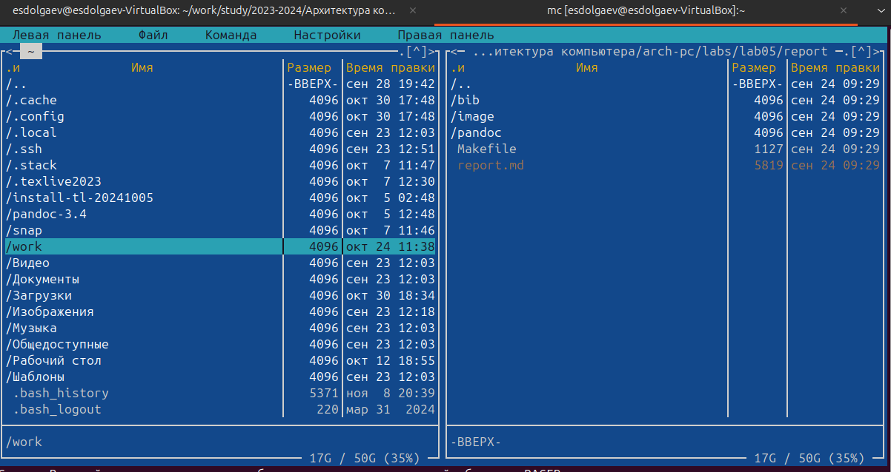{#fig:001 width=70%}

: Функциональные клавиши Midnight Commander {#tbl:1}

| Клавиша | Назначение                                                                                            |
|---------|-------------------------------------------------------------------------------------------------------|
|`F1`     | вызов контекстно-зависимой подсказки                                                                  |
|`F2`     | вызов меню, созданного пользователем                                                                  |
|`F3`     | просмотр файла, на который указывает подсветка в активной панели                                                                  |
|`F4`     | вызов встроенного редактора для файла, на который указывает подсветка в активной панели                                                                  |
|`F5`     | копирование файла или группы отмеченных файлов из каталога, отображаемого в активной панели, в каталог, отображаемый на второй панели                                                                  |
|`F6`     | перенос файла или группы отмеченных файлов из каталога, отображаемого в активной панели, в каталог, отображаемый на второй панели                                                                  |
|`F7`     | создание подкаталога в каталоге, отображаемом в активной панели                                                                  |
|`F8`     | удаление файла (подкаталога) или группы отмеченных файлов                                                                  |
|`F9`     | вызов основного меню программы                                                                  |
|`F10`    | выход из программы                                                                  |

Следующие комбинации клавиш облегчают работу с Midnight Commander:

- `Tab` используется для переключениями между панелями;
- `↑` и `↓` используется для навигации, `Enter` для входа в каталог или открытия файла (если в файле расширений `mc.ext` заданы правила связи определённых расширений файлов с инструментами их запуска или обработки);
- `Ctrl + u` (или через меню `Команда` > `Переставить панели` ) меняет местами содержимое правой и левой панелей;
- `Ctrl + o` (или через меню `Команда` > `Отключить панели` ) скрывает или возвращает панели `Midnight Commander`, за которыми доступен для работы командный интерпретатор оболочки и выводимая туда информация.
- `Ctrl + x + d` (или через меню `Команда` > `Сравнить каталоги` ) позволяет сравнить содержимое каталогов, отображаемых на левой и правой панелях.

## Cтруктура программы на языке ассемблера NASM

Программа на языке ассемблера `NASM`, как правило, состоит из трёх секций: секция кода программы (`SECTION .text`), секция инициированных (известных во время компиляции) данных (`SECTION .data`) и секция неинициализированных данных (тех, под которые во время компиляции только отводится память, а значение присваивается в ходе выполнения программы) (`SECTION .bss`).

Таким образом, общая структура программы имеет следующий вид:

```nasm
SECTION .data ; Секция содержит переменные, для
	... ; которых задано начальное значение
SECTION .bss ; Секция содержит переменные, для
	... ; которых не задано начальное значение
SECTION .text ; Секция содержит код программы
	GLOBAL _start
	_start: ; Точка входа в программу
	
	... ; Текст программы
	
	mov eax,1 ; Системный вызов для выхода (sys_exit)
	mov ebx,0 ; Выход с кодом возврата 0 (без ошибок)
	int 80h ; Вызов ядра
```
Для объявления инициированных данных в секции `.data` используются директивы `DB`, `DW`, `DD`, `DQ` и `DT`, которые резервируют память и указывают, какие значения должны храниться в этой памяти:

- `DB` (`define byte`) — определяет переменную размером в 1 байт;
- `DW` (`define word`) — определяет переменную размеров в 2 байта (слово);
- `DD` (`define double word`) — определяет переменную размером в 4 байта (двойное слово);
- `DQ` (`define quad word`) — определяет переменную размером в 8 байт (учетверённое слово);
- `DT` (`define ten bytes`) — определяет переменную размером в 10 байт.

Директивы используются для объявления простых переменных и для объявления массивов. Для определения строк принято использовать директиву DB в связи с особенностями хранения данных в оперативной памяти.

Синтаксис директив определения данных следующий:

> `<имя> DB <операнд> [, <операнд>] [, <операнд>]`

: Примеры {#tbl:2}

| Пример | Пояснение                                                                                            |
|-------------------|-------------------------------------------------------------------------------------------------------|
|a db 10011001b     | определяем переменную `a` размером 1 байт с начальным значением, заданным в двоичной системе счисления (на двоичную систему счисления указывает также буква `b` (`binary`) в конце числа) подсказки                                                                  |
|b db '!'           | определяем переменную `b` в 1 байт, инициализируемую символом `!`                                                                  |
|c db "Hello"       | определяем строку из 5 байт                                                                 |
|d dd -345d         | определяем переменную `d` размером 4 байта с начальным значением, заданным в десятичной системе счисления (на десятичную систему указывает буква `d` (`decimal`) в конце числа)                                                                  |
|h dd 0f1ah         | определяем переменную `h` размером 4 байта с начальным значением, заданным в шестнадцатеричной системе счисления (`h` - `hexadecimal`)                                                                  |

Для объявления неинициированных данных в секции .bss используются директивы resb, resw, resd и другие, которые сообщают ассемблеру, что необходимо зарезервировать заданное количество ячеек памяти. Примеры их использования приведены в табл. [-@tbl:3].

: Директивы для объявления неинициированных данных {#tbl:3}

| Директика | Назначение директивы | Аргумент | Назначение аргумента |
|-|-|-|-|
|`resb`|Резервирование заданного числа однобайтовых ячеек|`string resb 20`|По адресу с меткой `string` будет расположен массив из 20 однобайтовых ячеек (хранение строки символов)|
|`resw`|Резервирование заданного числа двухбайтовых ячеек (слов)|`count resw 256`|По адресу с меткой `count` будет расположен массив из 256 двухбайтовых слов|
|`resd`|Резервирование заданного числа четырёхбайтовых ячеек (двойных слов)|`x resd 1`|По адресу с меткой `x` будет расположено одно двойное слово (т.е. 4 байта для хранения большого числа)|

## Элементы программирования

### Описание инструкции mov

Инструкция языка ассемблера mov предназначена для дублирования данных источника в приёмнике. В общем виде эта инструкция записывается в виде

```nasm
mov dst,src
```

Здесь операнд dst — приёмник, а src — источник.

В качестве операнда могут выступать регистры (register), ячейки памяти (memory) и непосредственные значения (const). В табл. [-@tbl:4] приведены варианты использования mov с разными операндами.

: Варианты использования mov с разными операндами {#tbl:4}

| Тип операндов | Примеры | Пояснение |
|-|-|-|-|
|```mov <reg>,<reg>```|```mov eax,ebx```|пересылает значение регистра `ebx` в регистр `eax`|
|```mov <reg>,<mem>```|```mov cx,[eax]```|пересылает в регистр `cx` значение из памяти, указанной в `eax`|
|```mov <mem>,<reg>```|```mov rez,ebx```|пересылает в переменную `rez` значение из регистра `ebx`|
|```mov <reg>,<const>```|```mov eax,403045h```|пишет в регистр `eax` значение 403045h|
|```mov <mem>,<const>```|```mov byte[rez],0```|записывает в переменную `rez` значение 0|

ВАЖНО! Переслать значение из одной ячейки памяти в другую нельзя, для этого необходимо использовать две инструкции `mov`:

```nasm
mov eax, x
mov y, eax
```

Также необходимо учитывать то, что размер операндов приемника и источника должны совпадать. Использование слудующих примеров приведет к ошибке:

- ```mov al,1000h``` — ошибка, попытка записать 2-байтное число в 1-байтный регистр;
- ```mov eax,cx``` — ошибка, размеры операндов не совпадают.

### Описание инструкции int

Инструкция языка ассемблера intпредназначена для вызова прерывания с указанным номером. В общем виде она записывается в виде

```nasm
int n
```

Здесь `n` — номер прерывания, принадлежащий диапазону 0–255.

При программировании в `Linux` с использованием вызовов ядра `sys_calls n=80h` (принято задавать в шестнадцатеричной системе счисления).

После вызова инструкции `int 80h` выполняется системный вызов какой-либо функции ядра `Linux`. При этом происходит передача управления ядру операционной системы. Чтобы узнать, какую именно системную функцию нужно выполнить, ядро извлекает номер системного вызова из регистра `eax`. Поэтому перед вызовом прерывания необходимо поместить в этот регистр нужный номер. Кроме того, многим системным функциям требуется передавать какие-либо параметры. По принятым в ОС `Linux` правилам эти параметры помещаются в порядке следования в остальные регистры процессора: `ebx`, `ecx`, `edx`. Если системная функция должна вернуть значение, то она помещает его в регистр `eax`.

### Системные вызовы для обеспечения диалога с пользователем

Простейший диалог с пользователем требует наличия двух функций — вывода текста на экран и ввода текста с клавиатуры. Простейший способ вывести строку на экран — использовать системный вызов `write`. Этот системный вызов имеет номер 4, поэтому перед вызовом инструкции `int` необходимо поместить значение 4 в регистр `eax`. Первым аргументом `write`, помещаемым в регистр `ebx`, задаётся дескриптор файла. Для вывода на экран в качестведескриптора файла нужно указать 1 (это означает «стандартный вывод», т. е. вывод на экран). Вторым аргументом задаётся адрес выводимой строки (помещаем его в регистр `ecx`, например, инструкцией `mov ecx, msg`). Строка может иметь любую длину. Последним аргументом (т.е. в регистре `edx`) должна задаваться максимальная длина выводимой строки.

Для ввода строки с клавиатуры можно использовать аналогичный системный вызов `read`. Его аргументы – такие же, как у вызова `write`, только для «чтения» с клавиатуры используется файловый дескриптор 0 (стандартный ввод).

Системный вызов `exit` является обязательным в конце любой программы на языке ассемблер. Для обозначения конца программы перед вызовом инструкции `int 80h` необходимо поместить в регистр еах значение 1, а в регистр `ebx` код завершения 0.

# Выполнение лабораторной работы

Откроем `Midnught Commander` и с помощью клавиш `↑` и `↓` перейдем в каталог `~/work/arch-pc/, созданный при выполненнии лабораторной работы №4(рис. [-@fig:002], [-@fig:003])

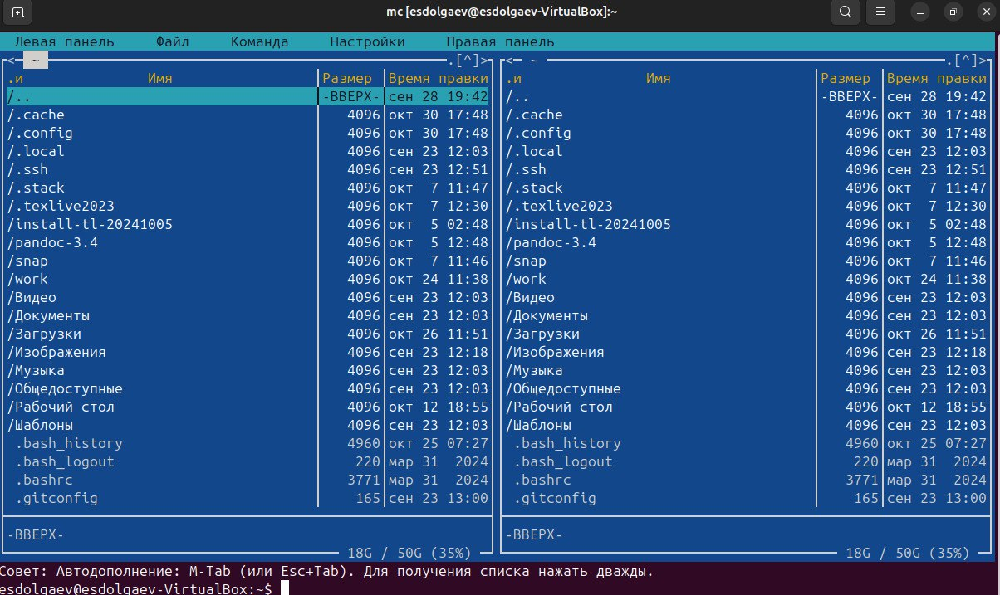{#fig:002 width=70%}

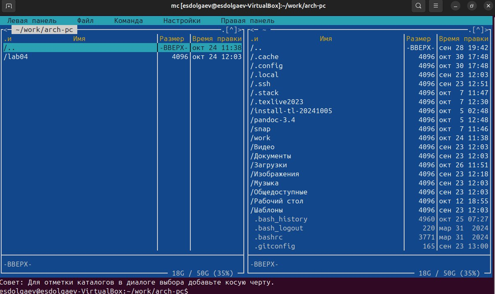{#fig:003 width=70%}

С помощью функциональной клавиши `F7` создадим папку `lab05` и, переёдя в неё, с помощью команды `touch` создадим файл `lab5-1.asm`(рис. [-@fig:004], [-@fig:005])

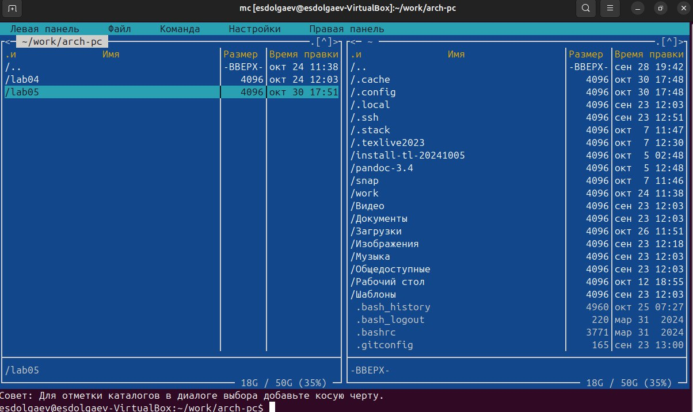{#fig:004 width=70%}

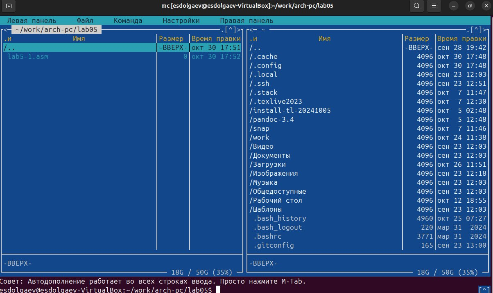{#fig:005 width=70%}

С помощью функциональной клавиши `F4` откроем файл `lab5-1.asm` для редактирования во встроенном редакторе. Как правило в качестве встроенного редактора `Midnight Commander` используются редакторы `nano` или `mcedit`(рис. [-@fig:006], [-@fig:007]).

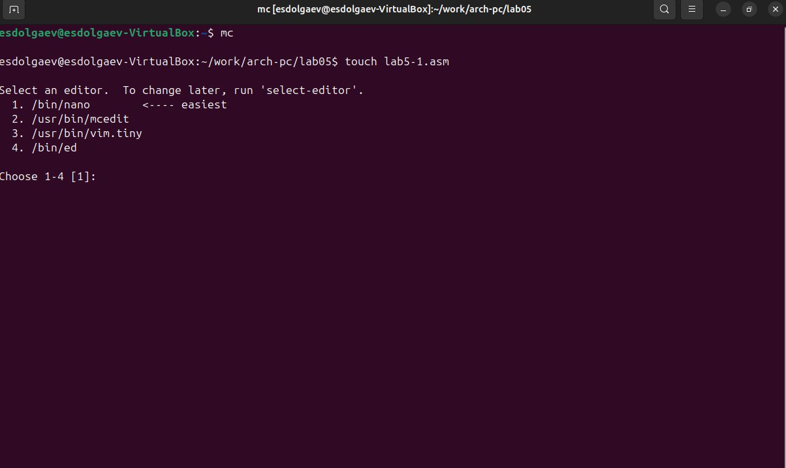{#fig:006 width=70%}

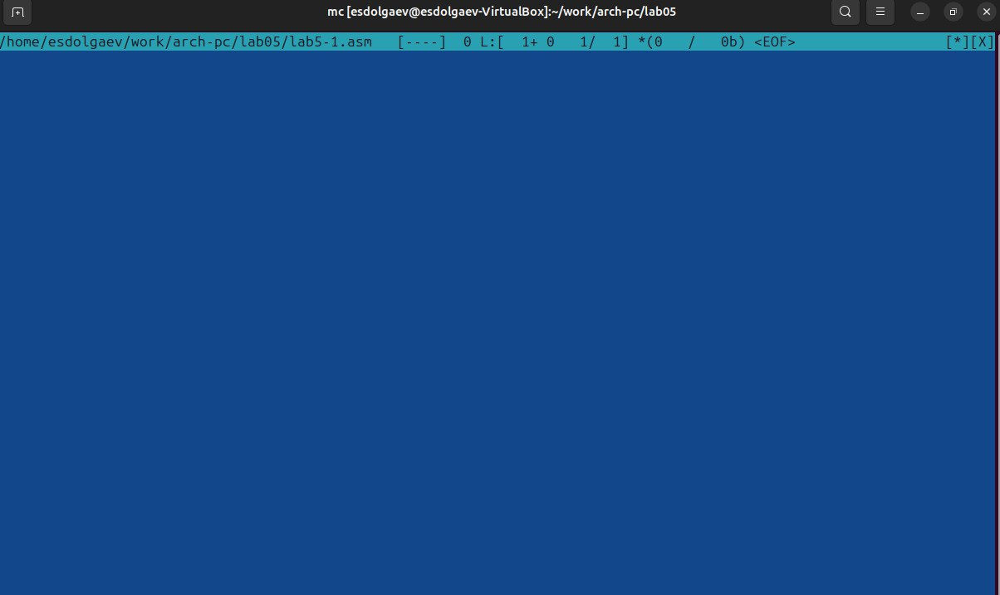{#fig:007 width=70%}

Введём текст программы, сохраним изменения и закроем файл(рис. [-@fig:008]).

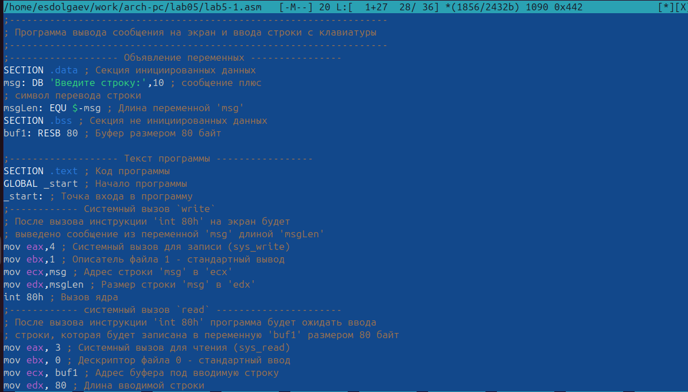{#fig:008 width=70%}

С помощью функциональной клавиши `F3` откроем файл `lab5-1.asm` для просмотра. Убедимся, что файл содержит текст программы(рис. [-@fig:009]).

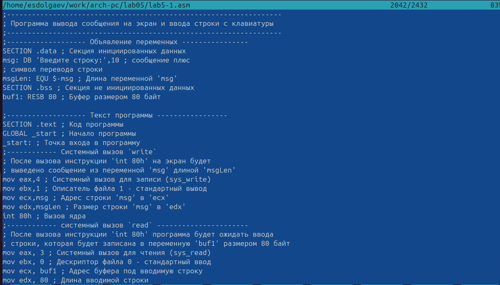{#fig:009 width=70%}

Оттранслируем текст программы lab5-1.asm в объектный файл. Выполним компоновку объектного файла и запустим получившийся исполняемый файл. Программа выводит строку 'Введите строку:' и ожидает ввода с клавиатуры. На запрос введём ФИО(рис. [-@fig:010], [-@fig:011]).

{#fig:010 width=70%}

{#fig:011 width=70%}

Далее, скачаем файл `in_out.asm` со страницы курса в ТУИС и переместим его в папку, где находится файл с программой(рис. [-@fig:012]).

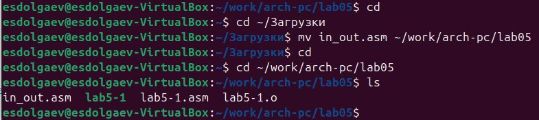{#fig:012 width=70%}

С помощью функциональной клавиши F6 создим копию файла lab5-1.asm с именем lab5-2.asm(рис. [-@fig:013]).

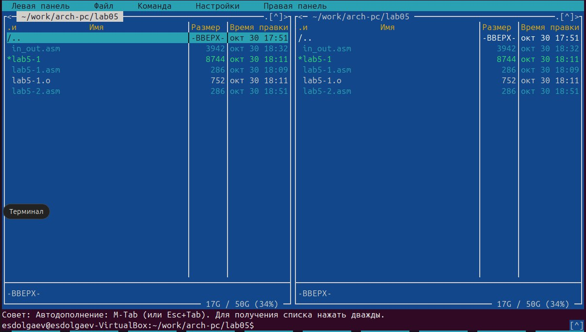{#fig:013 width=70%}

Исправим текст программы в файле `lab5-2.asm` с использование подпрограмм из внешнего файла `in_out.asm`. Создадим исполняемый файл и проверим его работу(рис. [-@fig:014], [-@fig:015]).

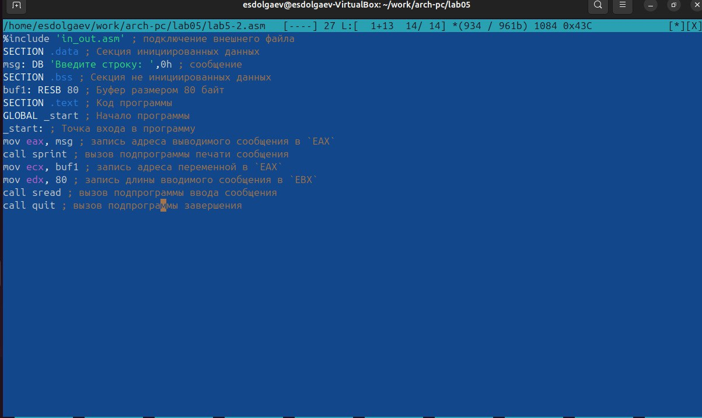{#fig:014 width=70%}

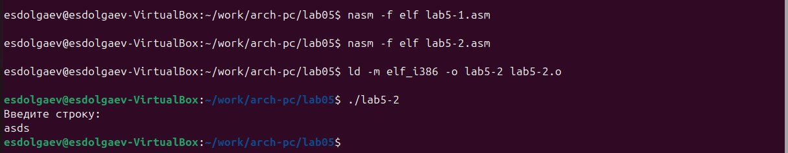{#fig:015 width=70%}

В файле lab5-2.asm заменим подпрограмму sprintLF на sprint. Создим исполняемый файл и проверим его работу(рис. [-@fig:016]).

{#fig:016 width=70%}

Теперь вводимая строка выводится ниже строки 'Введите строку:'.

## Задания для самостоятельной работы

Создадим копию файла `lab5-1.asm`. Внесём изменения в программу (без использования внешнего файла `in_out.asm`), так чтобы она работала по следующему алгоритму(рис. [-@fig:017], [-@fig:018]):

- вывести приглашение типа “Введите строку:”;
- ввести строку с клавиатуры;
- вывести введённую строку на экран.

Получим исполняемый файл и проверим его работу. На приглашение ввести строку введите свою фамилию(рис. [-@fig:019]).

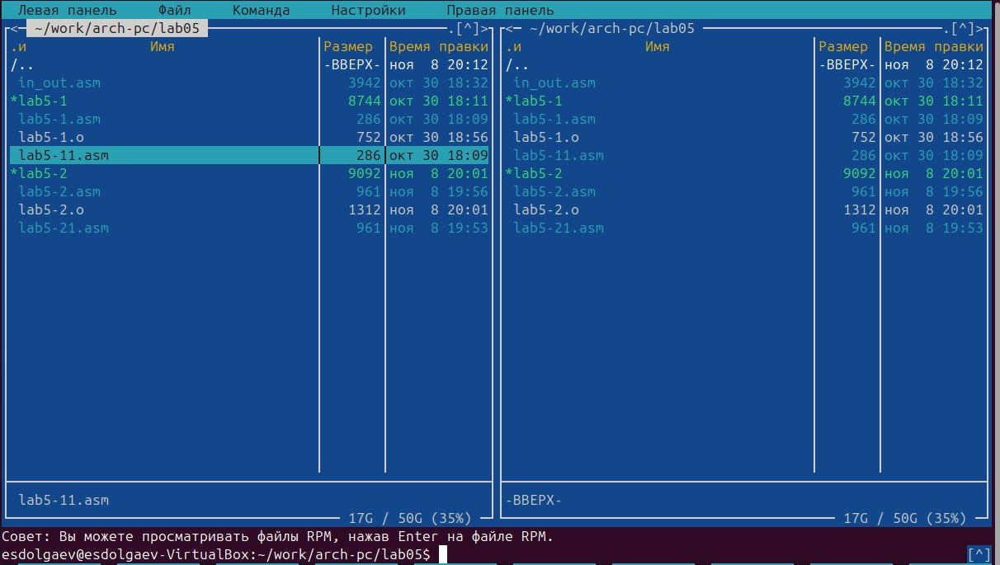{#fig:017 width=70%}

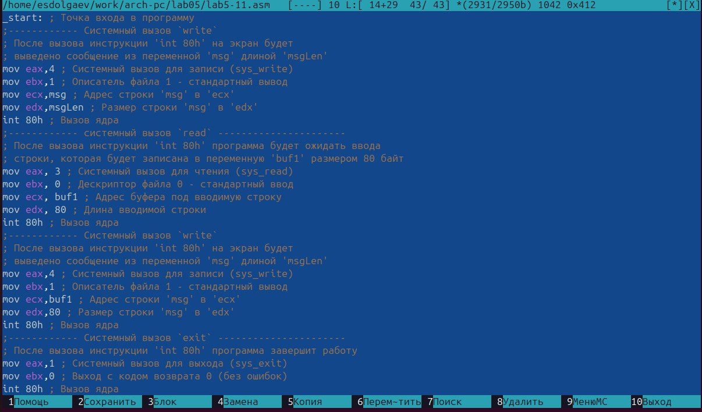{#fig:018 width=70%}

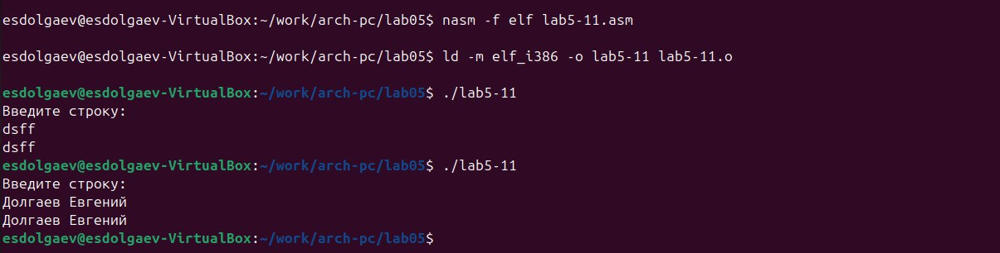{#fig:019 width=70%}

Создадим копию файла `lab5-2.asm`. Исправим текст программы с использование подпрограмм из внешнего файла `in_out.asm`, так чтобы она работала по следующему алгоритму(рис. [-@fig:020]):

- вывести приглашение типа “Введите строку:”;
- ввести строку с клавиатуры;
- вывести введённую строку на экран.

Создадим исполняемый файл и проверьте его работу(рис. [-@fig:020]).

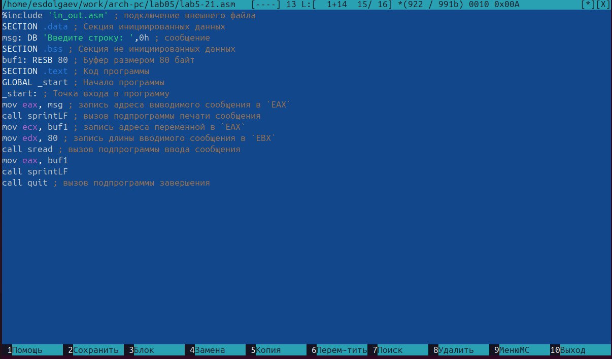{#fig:020 width=70%}

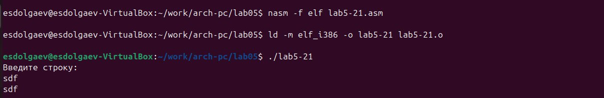{#fig:021 width=70%}

# Выводы

В ходе выполнения данной лабораторной работы я приобрёл практические навыки работы в *Midnight Commander* и освоил инструкций языка ассемблера `mov` и `int`.

# Список литературы{.unnumbered}

::: {#refs}
:::
