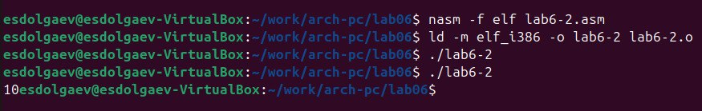

---
## Front matter
title: "Отчёт по лабораторной работе №6"
subtitle: "*Дисциплина: Архитектура компьютера*"
author: "Долгаев Евгений Сергеевич НММбд-01-24"

## Generic otions
lang: ru-RU
toc-title: "Содержание"

## Bibliography
bibliography: bib/cite.bib
csl: pandoc/csl/gost-r-7-0-5-2008-numeric.csl

## Pdf output format
toc: true # Table of contents
toc-depth: 2
lof: true # List of figures
lot: true # List of tables
fontsize: 12pt
linestretch: 1.5
papersize: a4
documentclass: scrreprt
## I18n polyglossia
polyglossia-lang:
  name: russian
  options:
	- spelling=modern
	- babelshorthands=true
polyglossia-otherlangs:
  name: english
## I18n babel
babel-lang: russian
babel-otherlangs: english
## Fonts
mainfont: IBM Plex Serif
romanfont: IBM Plex Serif
sansfont: IBM Plex Sans
monofont: IBM Plex Mono
mathfont: STIX Two Math
mainfontoptions: Ligatures=Common,Ligatures=TeX,Scale=0.94
romanfontoptions: Ligatures=Common,Ligatures=TeX,Scale=0.94
sansfontoptions: Ligatures=Common,Ligatures=TeX,Scale=MatchLowercase,Scale=0.94
monofontoptions: Scale=MatchLowercase,Scale=0.94,FakeStretch=0.9
mathfontoptions:
## Biblatex
biblatex: true
biblio-style: "gost-numeric"
biblatexoptions:
  - parentracker=true
  - backend=biber
  - hyperref=auto
  - language=auto
  - autolang=other*
  - citestyle=gost-numeric
## Pandoc-crossref LaTeX customization
figureTitle: "Рис."
tableTitle: "Таблица"
listingTitle: "Листинг"
lofTitle: "Список иллюстраций"
lotTitle: "Список таблиц"
lolTitle: "Листинги"
## Misc options
indent: true
header-includes:
  - \usepackage{indentfirst}
  - \usepackage{float} # keep figures where there are in the text
  - \floatplacement{figure}{H} # keep figures where there are in the text
---

# Цель работы

Освоение арифметических инструкций языка ассемблера NASM.

# Задание

1) Выполнение лабораторной работы
	1) Ответы на вопросы
2) Задания для самостоятельной работы

# Теоретическое введение

## Адресация в NASM

Большинство инструкций на языке ассемблера требуют обработки операндов. Адрес операнда предоставляет место, где хранятся данные, подлежащие обработке. Это могут быть данные хранящиеся в регистре или в ячейке памяти. Далее рассмотрены все существующие способы задания адреса хранения операндов – способы адресации.

Существует три основных способа адресации:

- **Регистровая адресация** – операнды хранятся в регистрах и в команде используются имена этих регистров, например: `mov ax,bx`.
- **Непосредственная адресация** – значение операнда задается непосредственно в команде, Например: `mov ax,2`.
- **Адресация памяти** – операнд задает адрес в памяти. В команде указывается символическое обозначение ячейки памяти, над содержимым которой требуется выполнить операцию.

Например, определим переменную `intg DD 3` – это означает, что задается область памяти размером 4 байта, адрес которой обозначен меткой `intg`. В таком случае, команда

```nasm
mov eax,[intg]
```

копирует из памяти по адресу intg данные в регистр eax. В свою очередь команда

```nasm
mov [intg],eax
```

запишет в память по адресу intg данные из регистра eax.

Также рассмотрим команду

```nasm
mov eax,intg
```

В этом случае в регистр eax запишется адрес `intg`. Допустим, для `intg` выделена память начиная с ячейки с адресом `0x600144`, тогда команда `mov eax,intg` аналогична команде `mov eax,0x600144` – т.е. эта команда запишет в регистр eax число `0x600144`.

## Арифметические операции в NASM

### Целочисленное сложение add

Схема команды целочисленного сложения `add` (от англ. *addition* - добавление) выполняет сложение двух операндов и записывает результат по адресу первого операнда. Команда `add` работает как с числами со знаком, так и без знака и выглядит следующим образом:

```nasm
add <операнд_1>, <операнд_2>
```

Допустимые сочетания операндов для команды `add` аналогичны сочетаниям операндов для команды `mov`.

Так, например, команда `add eax,ebx` прибавит значение из регистра `eax` к значению из регистра `ebx` и запишет результат в регистр `eax`.

Примеры:

```nasm
add ax,5 ; AX = AX + 5
add dx,cx ; DX = DX + CX
add dx,cl ; Ошибка: разный размер операндов.
```

### Целочисленное вычитание sub

Команда целочисленного вычитания `sub` (от англ. *subtraction* – вычитание) работает аналогично команде `add` и выглядит следующим образом:

```nasm
sub <операнд_1>, <операнд_2>
```

Так, например, команда `sub ebx,5` уменьшает значение регистра `ebx` на `5` и записывает результат в регистр `ebx`.

### Команды инкремента и декремента

Довольно часто при написании программ встречается операция прибавления или вычитания единицы. Прибавление единицы называется инкрементом, а вычитание — декрементом. Для этих операций существуют специальные команды: `inc` (от англ. *increment*) и `dec` (от англ. *decrement*), которые увеличивают и уменьшают на 1 свой операнд.

Эти команды содержат один операнд и имеет следующий вид:

```nasm
inc <операнд>
dec <операнд>
```

Операндом может быть регистр или ячейка памяти любого размера. Команды инкремента и декремента выгодны тем, что они занимают меньше места, чем соответствующие команды сложения и вычитания.

Так, например, команда `inc ebx` увеличивает значение регистра `ebx` на 1, а команда `inc ax` уменьшает значение регистра `ax` на 1.

### Команда изменения знака операнда neg

Еще одна команда, которую можно отнести к арифметическим командам это команда
изменения знака `neg`:

```nasm
neg <операнд>
```

Команда `neg` рассматривает свой операнд как число со знаком и меняет знак операнда на противоположный. Операндом может быть регистр или ячейка памяти любого размера.

```nasm
mov ax,1 ; AX = 1
neg ax ; AX = -1
```

### Команды умножения mul и imul

Умножение и деление, в отличии от сложения и вычитания, для знаковых и беззнаковых чисел производиться по-разному, поэтому существуют различные команды.

Для беззнакового умножения используется команда `mul` (от англ. *multiply* – умножение):

```nasm
mul <операнд>
```

Для знакового умножения используется команда `imul`:

```nasm
imul <операнд>
```

Для команд умножения один из сомножителей указывается в команде и должен находиться в регистре или в памяти, но не может быть непосредственным операндом. Второй сомножитель в команде явно не указывается и должен находиться в регистре `EAX,AX` или `AL`, а результат помещается в регистры `EDX:EAX, DX:AX` или `AX`, в зависимости от размера операнда [-@tbl:1].

: Регистры используемые командами умножения в Nasm {#tbl:1}

| Размер операнда | Неявный множитель | Результат умножения |
|-|-|-|
| 1 байт | AL | AX |
| 2 байта | AX | DX:AX |
| 4 байта | EAX | EDX:EAX |

Пример использования инструкции `mul`:

```nasm
a dw 270

mov ax, 100 ; AX = 100
mul a ; AX = AX*a,
mul bl ; AX = AL*BL
mul ax ; DX:AX = AX*AX
```

### Команды деления div и idiv

Для деления, как и для умножения, существует 2 команды `div` (от англ. *divide* - деление) и `idiv`:

```nasm
div <делитель> ; Беззнаковое деление
idiv <делитель> ; Знаковое деление
```

В командах указывается только один операнд – делитель, который может быть регистром или ячейкой памяти, но не может быть непосредственным операндом. Местоположение делимого и результата для команд деления зависит от размера делителя. Кроме того, так как в результате деления получается два числа – частное и остаток, то эти числа помещаются в определённые регистры [-@tbl:2].

: Регистры используемые командами деления в Nasm {#tbl:2}

| Размер операнда(делителя) | Делимое | Частное | Остаток |
|-|-|-|-|
| 1 байт | AX | AL | AH |
| 2 байта | DX:AX | AX | DX |
| 4 байта | EDX:EAX | EAX | EDX |

Например, после выполнения инструкций

```nasm
mov ax,31
mov dl,15
div dl
```

результат 2 (31/15) будет записан в регистр `al`, а остаток 1 (остаток от деления 31/15) — в регистр `ah`.

Если делитель — это слово (16-бит), то делимое должно записываться в регистрах `dx:ax`. Так в результате выполнения инструкций

```nasm
mov ax,2 ; загрузить в регистровую
mov dx,1 ; пару `dx:ax` значение 10002h
mov bx,10h
div bx
```

в регистр `ax` запишется частное 1000h (результат деления 10002h на 10h), а в регистр `dx` — 2 (остаток от деления).

## Перевод символа числа в десятичную символьную запись

Ввод информации с клавиатуры и вывод её на экран осуществляется в символьном виде. Кодирование этой информации производится согласно кодовой таблице символов ASCII. ASCII – сокращение от American Standard Code for Information Interchange (Американский стандартный код для обмена информацией). Согласно стандарту ASCII каждый символ кодируется одним байтом.

Расширенная таблица ASCII состоит из двух частей. Первая (символы с кодами 0-127) является универсальной, а вторая (коды 128-255) предназначена для специальных символов и букв национальных алфавитов и на компьютерах разных типов может меняться.

Среди инструкций NASM нет такой, которая выводит числа (не в символьном виде). Поэтому, например, чтобы вывести число, надо предварительно преобразовать его цифры в ASCII-коды этих цифр и выводить на экран эти коды, а не само число. Если же выводить число на экран непосредственно, то экран воспримет его не как число, а как последовательность ASCII-символов – каждый байт числа будет воспринят как один ASCII-символ – и выведет на экран эти символы.

Аналогичная ситуация происходит и при вводе данных с клавиатуры. Введенные данные будут представлять собой символы, что сделает невозможным получение корректного результата при выполнении над ними арифметических операций.

Для решения этой проблемы необходимо проводить преобразование ASCII символов в числа и обратно.

Для выполнения лабораторных работ в файле `in_out.asm` реализованы подпрограммы для преобразования ASCII символов в числа и обратно. Это:

- `iprint` – вывод на экран чисел в формате ASCII, перед вызовом `iprint` в регистр `eax` необходимо записать выводимое число (`mov eax,<int>`).
- `iprintLF` – работает аналогично `iprint`, но при выводе на экран после числа добавляет к символ перевода строки.
- `atoi` – функция преобразует ascii-код символа в целое число и записает результат в регистр `eax`, перед вызовом `atoi` в регистр `eax` необходимо записать число (`mov eax,<int>`).

# Выполнение лабораторной работы

Создим каталог для программ лабораторной работы № 6, перейдём в него и создим файл `lab6-1.asm`(рис. [-@fig:001]).

{#fig:001 width=70%}

Рассмотрим примеры программ вывода символьных и численных значений. Программы будут выводить значения записанные в регистр `eax`.

Введём в файл `lab6-1.asm` текст программы. В данной программе в регистр `eax` записывается символ `6 (mov eax,'6')`, в регистр `ebx` символ `4 (mov ebx,'4')`. Далее к значению в регистре `eax` прибавляем значение регистра `ebx` (`add eax,ebx`, результат сложения запишется в регистр `eax`). Далее выводим результат. Так как для работы функции `sprintLF` в регистр `eax` должен быть записан адрес, необходимо использовать дополнительную переменную. Для этого запишем значение регистра `eax` в переменную `buf1 (mov [buf1],eax)`, а затем запишем адрес переменной `buf1` в регистр `eax (mov eax,buf1)` и вызовем функцию `sprintLF`. Создим исполняемый файл и запустим его.(рис. [-@fig:002], [-@fig:003]).

{#fig:002 width=70%}

{#fig:003 width=70%}

В данном случае при выводе значения регистра `eax` мы ожидаем увидеть число 10. Однако результатом будет символ `j`. Это происходит потому, что код символа 6 равен 00110110 в двоичном представлении (или 54 в десятичном представлении), а код символа 4 – 00110100(52). Команда `add eax,ebx` запишет в регистр `eax` сумму кодов – 01101010 (106), что в свою очередь является кодом символа `j`.

Далее изменим текст программы и вместо символов, запишем в регистры числа. Исправьте текст программы следующим образом: замените строки(рис. [-@fig:004])

```nasm
mov eax,'6'
mov ebx,'4'
```

на строки

```nasm
mov eax,6
mov ebx,4
```

{#fig:004 width=70%}

Создим исполняемый файл и запустим его (рис. [-@fig:005]).

{#fig:005 width=70%}

Как и в предыдущем случае при исполнении программы мы не получим число 10. В данном
случае выводится символ с кодом 10(рис. [-@fig:006]). На экран он не выводиться. 

{#fig:006 width=70%}

Как отмечалось выше, для работы с числами в файле in_out.asm реализованы подпрограммы для преобразования ASCII символов в числа и обратно. Преобразуем текст программы с использованием этих функций.

Создим файл `lab6-2.asm` в каталоге `~/work/arch-pc/lab06` и введём в него текст программы(рис. [-@fig:007], [-@fig:008]).

{#fig:007 width=70%}

{#fig:008 width=70%}

Создим исполняемый файл и запустим его(рис. [-@fig:009]).

{#fig:009 width=70%}

В результате работы программы мы получим число 106. В данном случае, как и в первом, команда `add` складывает коды символов ‘6’ и ‘4’ (54+52=106).

Аналогично предыдущему примеру изменим символы на числа. Замените строки(рис. [-@fig:010])

```nasm
mov eax,'6'
mov ebx,'4'
```

на строки

```nasm
mov eax,6
mov ebx,4
```

{#fig:010 width=70%}

Создим исполняемый файл и запустим его. Программа выведет число 10(рис. [-@fig:011]).

{#fig:011 width=70%}

Заменим функцию `iprintLF` на `iprint`. Создим исполняемый файл и запустим его. Результат выведится в той же строчке, что и команда(рис. [-@fig:012]).

{#fig:012 width=70%}

В качестве примера выполнения арифметических операций в NASM приведем программу вычисления арифметического выражения f(x) = (5 * 2 + 3)/3.

Создим файл `lab6-3.asm` в каталоге `~/work/arch-pc/lab06` и введём в него текст программы(рис. [-@fig:013], [-@fig:014]).

{#fig:013 width=70%}

{#fig:014 width=70%}

Создим исполняемый файл и запустим его(рис. [-@fig:015]).

{#fig:015 width=70%}

Изменим текст программы для вычисления выражения f(x) = (4 * 6 + 2)/5. Создим исполняемый файл и проверим его работу(рис. [-@fig:016], [-@fig:017]).

{#fig:016 width=70%}

{#fig:017 width=70%}

В качестве другого примера рассмотрим программу вычисления варианта задания по номеру студенческого билета, работающую по следующему алгоритму:

- вывести запрос на введение № студенческого билета
- вычислить номер варианта по формуле: (Sn mod 20) + 1, где Sn – номер студенческого билета (В данном случае a mod b – это остаток от деления a на b).
- вывести на экран номер варианта.

В данном случае число, над которым необходимо проводить арифметические операции, вводится с клавиатуры. Как отмечалось выше ввод с клавиатуры осуществляется в символьном виде и для корректной работы арифметических операций в NASM символы необходимо преобразовать в числа. Для этого может быть использована функция `atoi` из файла `in_out.asm`.

Создим файл `variant.asm` в каталоге `~/work/arch-pc/lab06` и и введём в него текст программы(рис. [-@fig:018], [-@fig:019]).

{#fig:018 width=70%}

{#fig:019 width=70%}

Создайте исполняемый файл и запустите его(рис. [-@fig:020]).

{#fig:020 width=70%}

## Ответы на вопросы

1) Какие строки листинга 6.4 отвечают за вывод на экран сообщения ‘Ваш вариант:’?

```nasm
mov eax,rem
call sprint
```

2) Для чего используется следующие инструкции?

```nasm
mov ecx, x
mov edx, 80
call sread
```

Для записи переменной x, введённой с клавиатуры, в регистр eax

3) Для чего используется инструкция “call atoi”?

Для преобразования кода в число

4) Какие строки листинга 6.4 отвечают за вычисления варианта?

```nasm
xor edx,edx
mov ebx,20
div ebx
inc edx
```

5) В какой регистр записывается остаток от деления при выполнении инструкции “div ebx”?

В регистр edx

6) Для чего используется инструкция “inc edx”?

Для увеличения операнда на единицу

7) Какие строки листинга 6.4 отвечают за вывод на экран результата вычислений?

```nasm
mov eax,edx
call iprintLF
```

# Задание для самостоятельной работы

Создадим файл variant8.asm, введём в него текст программы, создадим исполняемый файл и проверим его работу(рис. [-@fig:021], [-@fig:022], [-@fig:023]).

{#fig:021 width=70%}

{#fig:022 width=70%}

{#fig:023 width=70%}

# Выводы

В ходе выполнения лабораторной работы я освоил арифметические инструкции языка ассемблера NASM.

# Список литературы{.unnumbered}

::: {#refs}
:::
