---
## Front matter
title: "Отчёт по лабораторной работе №7"
subtitle: "*Дисциплина: Архитектура компьютера*"
author: "Долгаев Евгений Сергеевич НММбд-01-24"

## Generic otions
lang: ru-RU
toc-title: "Содержание"

## Bibliography
bibliography: bib/cite.bib
csl: pandoc/csl/gost-r-7-0-5-2008-numeric.csl

## Pdf output format
toc: true # Table of contents
toc-depth: 2
lof: true # List of figures
lot: true # List of tables
fontsize: 12pt
linestretch: 1.5
papersize: a4
documentclass: scrreprt
## I18n polyglossia
polyglossia-lang:
  name: russian
  options:
	- spelling=modern
	- babelshorthands=true
polyglossia-otherlangs:
  name: english
## I18n babel
babel-lang: russian
babel-otherlangs: english
## Fonts
mainfont: IBM Plex Serif
romanfont: IBM Plex Serif
sansfont: IBM Plex Sans
monofont: IBM Plex Mono
mathfont: STIX Two Math
mainfontoptions: Ligatures=Common,Ligatures=TeX,Scale=0.94
romanfontoptions: Ligatures=Common,Ligatures=TeX,Scale=0.94
sansfontoptions: Ligatures=Common,Ligatures=TeX,Scale=MatchLowercase,Scale=0.94
monofontoptions: Scale=MatchLowercase,Scale=0.94,FakeStretch=0.9
mathfontoptions:
## Biblatex
biblatex: true
biblio-style: "gost-numeric"
biblatexoptions:
  - parentracker=true
  - backend=biber
  - hyperref=auto
  - language=auto
  - autolang=other*
  - citestyle=gost-numeric
## Pandoc-crossref LaTeX customization
figureTitle: "Рис."
tableTitle: "Таблица"
listingTitle: "Листинг"
lofTitle: "Список иллюстраций"
lotTitle: "Список таблиц"
lolTitle: "Листинги"
## Misc options
indent: true
header-includes:
  - \usepackage{indentfirst}
  - \usepackage{float} # keep figures where there are in the text
  - \floatplacement{figure}{H} # keep figures where there are in the text
---

# Цель работы

Изучение команд условного и безусловного переходов. Приобретение навыков написания программ с использованием переходов. Знакомство с назначением и структурой файла листинга.

# Задание

1) Выполнение лабораторной работы
	1) Реализация переходов в NASM
	2) Изучение структуры файлы листинга
2) Задания для самостоятельной работы

# Теоретическое введение

Для реализации ветвлений в ассемблере используются так называемые команды передачи управления или команды перехода. Можно выделить 2 типа переходов:

- условный переход – выполнение или не выполнение перехода в определенную точку программы в зависимости от проверки условия.
- безусловный переход – выполнение передачи управления в определенную точку программы без каких-либо условий.

### Команда безусловного перехода

Безусловный переход выполняется инструкцией `jmp` (от англ. `jump` – прыжок), которая включает в себя адрес перехода, куда следует передать управление:

```nasm
jmp <адрес_перехода>
```

Адрес перехода может быть либо меткой, либо адресом области памяти, в которую предварительно помещен указатель перехода. Кроме того, в качестве операнда можно использовать имя регистра, в таком случае переход будет осуществляться по адресу, хранящемуся в этом регистре (табл. [-@tbl:1]).

: Типы операндов инструкции jmp {#tbl:1}

| Тип операнда | Описание |
|-|-|
| jmp label | переход на метку label |
| jmp [label] | переход по адресу в памяти, помеченному меткой label |
| jmp eax | переход по адресу из регистра eax |

В следующем примере рассмотрим использование инструкции `jmp`:

```nasm
label:
... ;
... ; команды
... ;
jmp label
```

### Команда условного перехода

Как отмечалось выше, для условного перехода необходима проверка какого-либо условия. В ассемблере команды условного перехода вычисляют условие перехода анализируя флаги из регистра флагов.

### Регистр флагов

Флаг – это бит, принимающий значение 1 («флаг установлен»), если выполнено некоторое условие, и значение 0 («флаг сброшен») в противном случае. Флаги работают независимо друг от друга, и лишь для удобства они помещены в единый регистр — регистр флагов, отражающий текущее состояние процессора. В следующей таблице указано положение битовых флагов в регистре флагов (рис. [-@fig:001]).

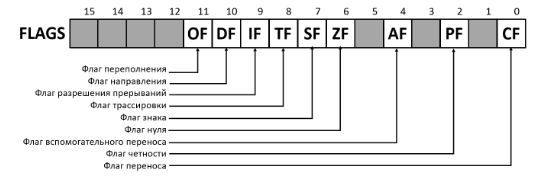{#fig:001 width=70%}

Флаги состояния (биты 0, 2, 4, 6, 7 и 11) отражают результат выполнения арифметических инструкций, таких как `ADD`, `SUB`, `MUL`, `DIV`.

: Регистр флагов {#tbl:2}

| Бит | Обозначение | Название | Описание |
|-|-|-|-|
| 0 | CF | Carry Flag - Флаг переноса | Устанавливается в 1, если при выполнении предыдущей операции произошёл перенос из старшего бита или если требуется заём (при вычитании). Иначе установлен в 0. |
| 2 | PF | Parity Flag - Флаг чётности | Устанавливается в 1, если младший байт результата предыдущей операции содержит чётное количество битов, равных 1. |
| 4 | AF | Auxiliary Carry Flag - Вспомогательный флаг переноса | Устанавливается в 1, если в результате предыдущей операции произошёл перенос (или заём) из третьего бита в четвёртый. |
| 6 | ZF | Zero Flag - Флаг нуля | Устанавливается 1, если результат предыдущей команды равен 0. |
| 7 | SF | Sign Flag - Флаг знака | Равен значению старшего значащего бита результата, который является знаковым битом в знаковой арифметике. |
| 11 | SF | Overflow Flag - Флаг переполнения | Устанавливается в 1, если целочисленный результат слишком длинный для размещения в целевом операнде (регистре или ячейке памяти). |

### Описание инструкции cmp

Инструкция cmp является одной из инструкций, которая позволяет сравнить операнды и выставляет флаги в зависимости от результата сравнения.

Инструкция `cmp` является командой сравнения двух операндов и имеет такой же формат, как и команда вычитания:

```nasm
cmp <операнд_1>, <операнд_2>
```

Команда `cmp`, так же как и команда вычитания, выполняет вычитание `<операнд_2> - <операнд_1>`, но результат вычитания никуда не записывается и единственным результатом команды сравнения является формирование флагов.

Примеры.

```nasm
cmp ax,'4' ; сравнение регистра ax с символом 4
cmp ax,4 ; сравнение регистра ax со значением 4
cmp al,cl ; сравнение регистров al и cl
cmp [buf],ax ; сравнение переменной buf с регистром ax
```

### Описание команд условного перехода.

Команда условного перехода имеет вид

```nasm
j<мнемоника перехода> label
```

Мнемоника перехода связана со значением анализируемых флагов или со способом формирования этих флагов.

В табл. [-@tbl:3] представлены команды условного перехода, которые обычно ставятся после команды сравнения `cmp`. В их мнемокодах указывается тот результат сравнения, при котором надо делать переход. Мнемоники, идентичные по своему действию, написаны в таблице через дробь (например, `ja` и `jnbe`). Программист выбирает, какую из них применить, чтобы получить более простой для понимания текст программы.

: Инструкции условной передачи управления по результатам арифметического сравнения cmp a,b {#tbl:3}

| Типы операндов | Мнемокод | Критерий условного перехода a (<,>,<=,>=,=) b  | Комментарий |
|-|-|-|-|
| Любые | JE | `a = b`  | ZF = 1 | Переход если равно |
| Любые | JNE | `not(a = b)` | ZF = 0 | Переход если не равно |
| Со знаком | Jl/JNGE | `a < b` | not(SF = OF) | Переход если меньше |
| Со знаком | JLE/JNG | `a <= b` | not(SF = OF) или ZF = 1 | Переход если меньше или равно |
| Со знаком | JG/JNLE | `a > b` | SF = OF и ZF = 0 | Переход если больше |
| Со знаком | JGE/JNL | `a >= b` | SF = OF | Переход если больше или равно |
| Без знака | JB/JNAE  | `a < b` | CF = 1 | Переход если ниже |
| Без знака | JBE/JNA  | `a <= b` | CF = 1 или ZF = 1 | Переход если ниже или равно |
| Без знака | JA/JNBE  | `a > b` | CF = 0 и ZF = 0 | Переход если выше |
| Без знака | JAE/JNB  | `a >= b` | CF = 0 | Переход если выше или равно |

Примечание: термины «выше» («`a`» от англ. «`above`») и «ниже» («`b`» от англ. «`below`») применимы для сравнения беззнаковых величин (адресов), а термины «больше» («`g`» от англ. «`greater`») и «меньше» («`l`» от англ. «`lower`») используются при учёте знака числа. Таким образом, мнемонику инструкции `JA/JNBE` можно расшифровать как «*jump if above* (переход если выше) / *jump if not below equal* (переход если не меньше или равно)».

Помимо перечисленных команд условного перехода существуют те, которые которые можно использовать после любых команд, меняющих значения флагов (табл. [-@tbl:4]).

: Инструкции условной передачи управления {#tbl:4}

| Мнемокод | Значение флага для осуществления перехода | Мнемокод  | Значение флага для осуществления переход |
|-|-|-|-|
| JZ | ZF = 1 | JNZ | ZF = 0 |
| JS | SF = 1 | JNS | SF = 0 |
| JC | CF = 1 | JNC | CF = 0 |
| JO | OF = 1 | JNO | OF = 0 |
| JP | PF = 1 | JNP | PF = 0 |

В качестве примера рассмотрим фрагмент программы, которая выполняет умножение переменных `a` и `b` и если произведение превосходит размер байта, передает управление на метку `Error`.

```nasm
mov al, a
mov bl, b
mul bl
jc Error
```

## Файл листинга и его структура

Листинг (в рамках понятийного аппарата NASM) — это один из выходных файлов, создаваемых транслятором. Он имеет текстовый вид и нужен при отладке программы, так как кроме строк самой программы он содержит дополнительную информацию.

Ниже приведён фрагмент файла листинга.

```nasm
10 00000000 B804000000 mov eax,4
11 00000005 BB01000000 mov ebx,1
12 0000000A B9[00000000] mov ecx,hello
13 0000000F BA0D000000 mov edx,helloLen
14
15 00000014 CD80 int 80h
```

Строки в первой части листинга имеют следующую структуру (рис. [-@fig:002]).

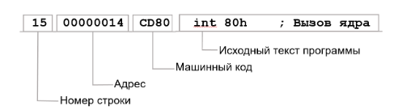{#fig:002 width=70%}

Все ошибки и предупреждения, обнаруженные при ассемблировании, транслятор выводит на экран, и файл листинга не создаётся.

Итак, структура листинга:

- *номер строки* — это номер строки файла листинга (нужно помнить, что номер строки в файле листинга может не соответствовать номеру строки в файле с исходным текстом программы);
- *адрес* — это смещение машинного кода от начала текущего сегмента;
- *машинный код* представляет собой ассемблированную исходную строку в виде шестнадцатеричной последовательности. (например, инструкция `int 80h` начинается по смещению `00000020` в сегменте кода; далее идёт машинный код, в который ассемблируется инструкция, то есть инструкция `int 80h` ассемблируется в `CD80` (в шестнадцатеричном представлении); `CD80` — это инструкция на машинном языке, вызывающая прерывание ядра);
- *исходный текст программы* — это просто строка исходной программы вместе с комментариями (некоторые строки на языке ассемблера, например, строки, содержащие только комментарии, не генерируют никакого машинного кода, и поля «смещение» и «исходный текст программы» в таких строках отсутствуют, однако номер строки им присваивается).

# Выполнение лабораторной работы

Создим каталог для программ лабораторной работы № 7(рис. [-@fig:003])

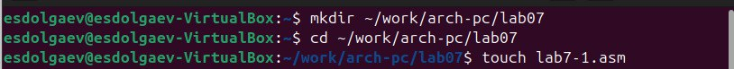{#fig:003 width=70%}

Инструкция `jmp` в NASM используется для реализации безусловных переходов. Рассмотрим пример программы с использованием инструкции `jmp`. Введём в файл `lab7-1.asm` текст программы(рис. [-@fig:004])

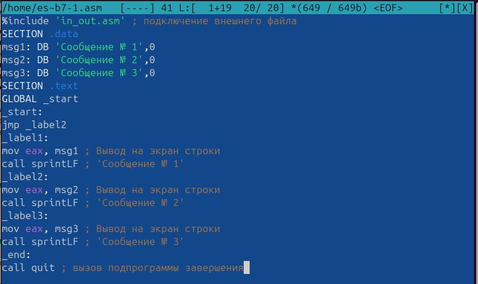{#fig:004 width=70%}

Создим исполняемый файл и запустим его. Результат работы данной программы будет следующим(рис. [-@fig:005]):

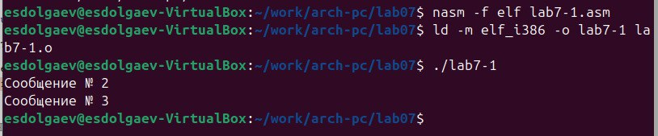{#fig:005 width=70%}

Таким образом, использование инструкции `jmp _label2` меняет порядок исполнения
инструкций и позволяет выполнить инструкции начиная с метки `_label2`, пропустив вывод
первого сообщения.

Инструкция `jmp` позволяет осуществлять переходы не только вперед но и назад. Изменим программу таким образом, чтобы она выводила сначала ‘Сообщение № 2’, потом ‘Сообщение № 1’ и завершала работу. Для этого в текст программы после вывода сообщения № 2 добавим инструкцию `jmp` с меткой `_label1` (т.е. переход к инструкциям вывода сообщения № 1) и после вывода сообщения № 1 добавим инструкцию `jmp` с меткой `_end` (т.е. переход к инструкции `call quit`)(рис. [-@fig:006]). 

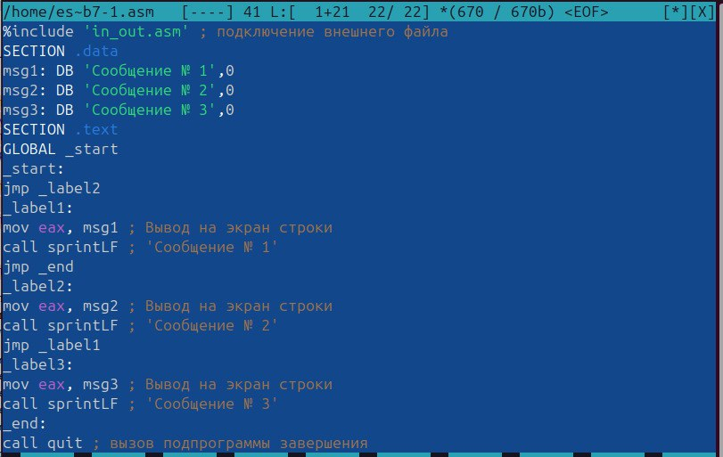{#fig:006 width=70%}

Создим исполняемый файл и проверим его работу(рис. [-@fig:007]).

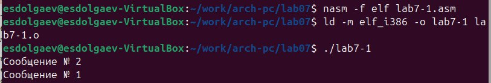{#fig:007 width=70%}

Изменим текст программы добавив или изменив инструкции jmp, чтобы вывод програм-
мы был следующим(рис. [-@fig:008]):

```
Сообщение № 3
Сообщение № 2
Сообщение № 1
```
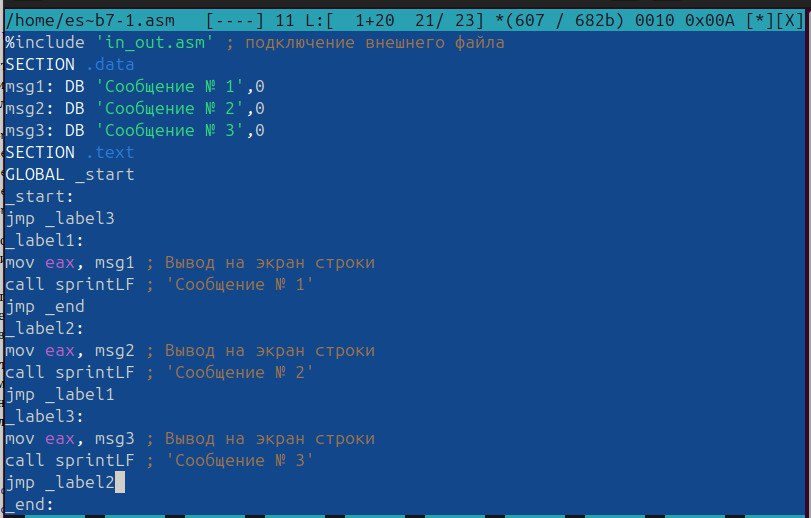{#fig:008 width=70%}

Создим исполняемый файл и проверим его работу(рис. [-@fig:009]).

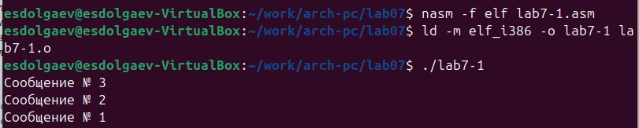{#fig:009 width=70%}

Создим файл `lab7-2.asm` в каталоге `~/work/arch-pc/lab07` и введём в него текст программы(рис. [-@fig:010], [-@fig:011]).

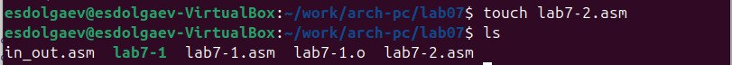{#fig:010 width=70%}

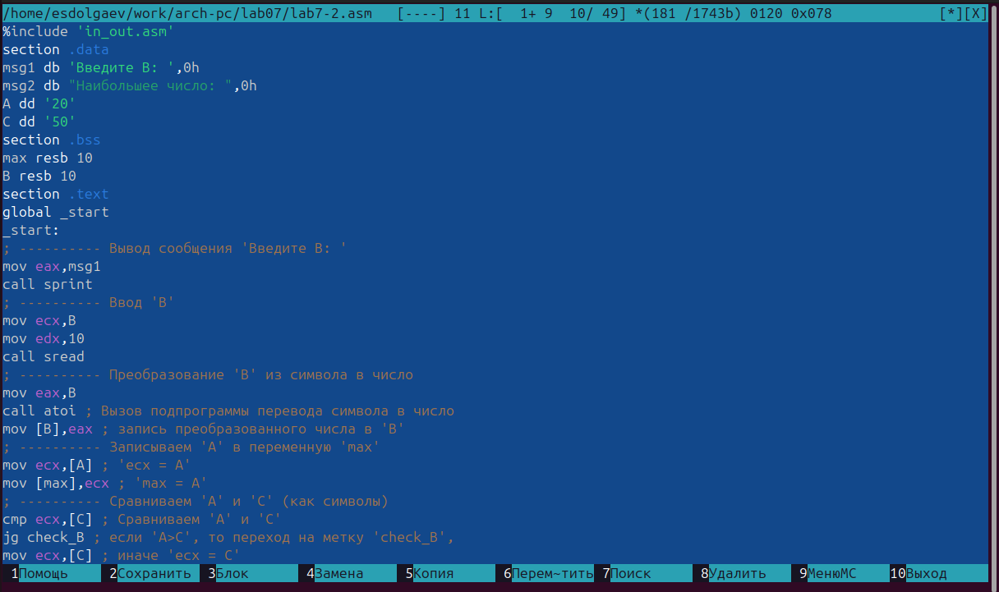{#fig:011 width=70%}

Создим исполняемый файл и проверим его работу(рис. [-@fig:012]).

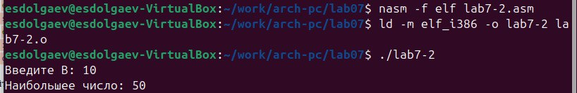{#fig:012 width=70%}

Создим файл листинга для программы из файла `lab7-2.asm` и откроем его с помощью любого текстового редактора mcedit(рис. [-@fig:013], [-@fig:014]).

{#fig:013 width=70%}

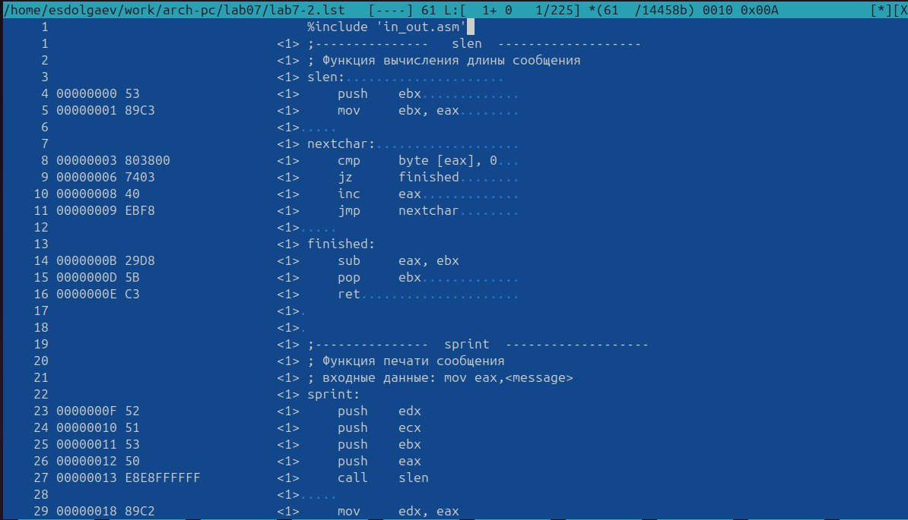{#fig:014 width=70%}

Откроем файл с программой `lab7-2.asm` и в любой инструкции с двумя операндами удалим один операнд. Выполним трансляцию с получением файла листинга(рис. [-@fig:015], [-@fig:016]).

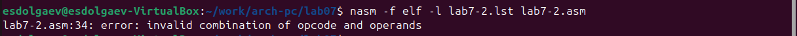{#fig:015 width=70%}

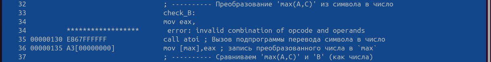{#fig:016 width=70%}

Файл создался тот же, но в нём появилась пометка об ошибке.

## Задания для самостоятельной работы

Создадим копию файла `lab7-2.asm` и введём в него текст программы которая находит наименьшее из трёх чисел. Создадим исполняемый файл и проверим его работу(рис. [-@fig:015], [-@fig:016]).

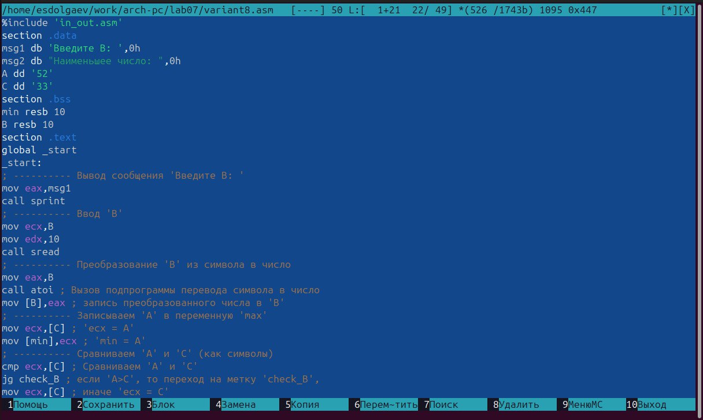{#fig:017 width=70%}

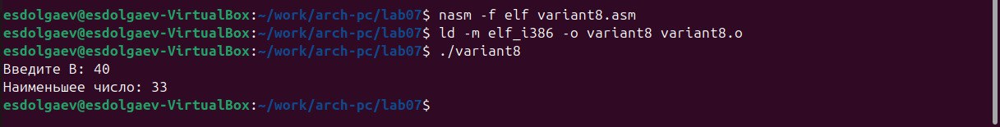{#fig:018 width=70%}

Далее напишем программу, которая для введенных с клавиатуры значений x и a вычисляет
значение заданной функции *f(x)* и выводит результат вычислений(рис. [-@fig:019], [-@fig:020]).

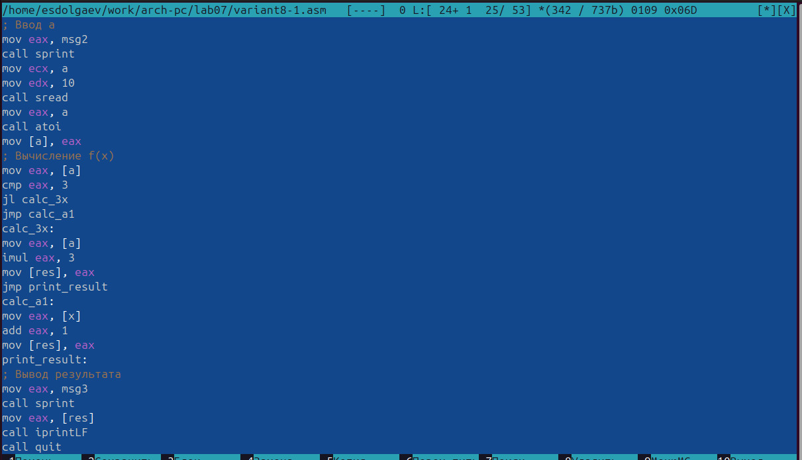{#fig:019 width=70%}

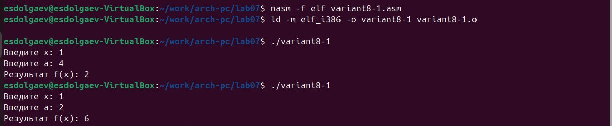{#fig:020 width=70%}

# Выводы

В ходе выполнения лабораторной работы, я изучил команды условного и безусловного переходов, приобрёл навыки написания программ с использованием переходов и познакомился с назначением и структурой файла листинга.

# Список литературы{.unnumbered}

::: {#refs}
:::
