---
## Front matter
title: "Отчёт по лабораторной работе №8"
subtitle: "*Дисциплина: Архитектура компьютера*"
author: "Долгаев Евгений Сергеевич НММбд-01-24"

## Generic otions
lang: ru-RU
toc-title: "Содержание"

## Bibliography
bibliography: bib/cite.bib
csl: pandoc/csl/gost-r-7-0-5-2008-numeric.csl

## Pdf output format
toc: true # Table of contents
toc-depth: 2
lof: true # List of figures
lot: true # List of tables
fontsize: 12pt
linestretch: 1.5
papersize: a4
documentclass: scrreprt
## I18n polyglossia
polyglossia-lang:
  name: russian
  options:
	- spelling=modern
	- babelshorthands=true
polyglossia-otherlangs:
  name: english
## I18n babel
babel-lang: russian
babel-otherlangs: english
## Fonts
mainfont: IBM Plex Serif
romanfont: IBM Plex Serif
sansfont: IBM Plex Sans
monofont: IBM Plex Mono
mathfont: STIX Two Math
mainfontoptions: Ligatures=Common,Ligatures=TeX,Scale=0.94
romanfontoptions: Ligatures=Common,Ligatures=TeX,Scale=0.94
sansfontoptions: Ligatures=Common,Ligatures=TeX,Scale=MatchLowercase,Scale=0.94
monofontoptions: Scale=MatchLowercase,Scale=0.94,FakeStretch=0.9
mathfontoptions:
## Biblatex
biblatex: true
biblio-style: "gost-numeric"
biblatexoptions:
  - parentracker=true
  - backend=biber
  - hyperref=auto
  - language=auto
  - autolang=other*
  - citestyle=gost-numeric
## Pandoc-crossref LaTeX customization
figureTitle: "Рис."
tableTitle: "Таблица"
listingTitle: "Листинг"
lofTitle: "Список иллюстраций"
lotTitle: "Список таблиц"
lolTitle: "Листинги"
## Misc options
indent: true
header-includes:
  - \usepackage{indentfirst}
  - \usepackage{float} # keep figures where there are in the text
  - \floatplacement{figure}{H} # keep figures where there are in the text
---

# Цель работы

Приобретение навыков написания программ с использованием циклов и обработкой аргументов командной строки.

# Задание

1) Выполнение лабораторной работы
	1) Реализация циклов в NASM
	2) Обработка аргументов командной строки
2) Задание для самостоятельной работы

# Теоретическое введение

## Организация стека

Стек — это структура данных, организованная по принципу LIFO («Last In — First Out» или «последним пришёл — первым ушёл»). Стек является частью архитектуры процессора и реализован на аппаратном уровне. Для работы со стеком в процессоре есть специальные регистры (`ss`, `bp`, `sp`) и команды.

Основной функцией стека является функция сохранения адресов возврата и передачи аргументов при вызове процедур. Кроме того, в нём выделяется память для локальных переменных и могут временно храниться значения регистров.

На рис. [-@fig:001] показана схема организации стека в процессоре.

Стек имеет вершину, адрес последнего добавленного элемента, который хранится в регистре `esp` (указатель стека). Противоположный конец стека называется дном. Значение, помещённое в стек последним, извлекается первым. При помещении значения в стек указатель стека уменьшается, а при извлечении — увеличивается.

Для стека существует две основные операции:

- добавление элемента в вершину стека (`push`);
- извлечение элемента из вершины стека (`pop`).

### Добавление элемента в стек

Команда `push` размещает значение в стеке, т.е. помещает значение в ячейку памяти, на которую указывает регистр `esp`, после этого значение регистра esp увеличивается на 4. Данная команда имеет один операнд — значение, которое необходимо поместить в стек.

Примеры:

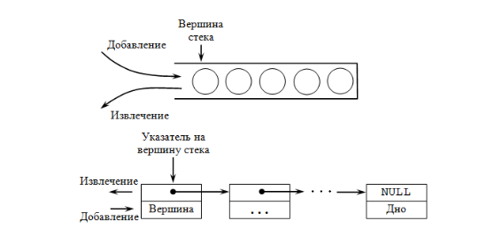{#fig:001 width=70%}

```nasm
push -10 ; Поместить -10 в стек
push ebx ; Поместить значение регистра ebx в стек
push [buf] ; Поместить значение переменной buf в стек
push word [ax] ; Поместить в стек слово по адресу в ax
```

Существует ещё две команды для добавления значений в стек. Это команда `pusha`, которая помещает в стек содержимое всех регистров общего назначения в следующем порядке: `ах`, `сх`, `dx`, `bх`, `sp`, `bp`, `si`, `di`. А также команда `pushf`, которая служит для перемещения в стек содержимого регистра флагов. Обе эти команды не имеют операндов.

### Извлечение элемента из стека

Команда `pop` извлекает значение из стека, т.е. извлекает значение из ячейки памяти, на которую указывает регистр `esp`, после этого уменьшает значение регистра `esp` на 4. У этой команды также один операнд, который может быть регистром или переменной в памяти. 

Нужно помнить, что извлечённый из стека элемент не стирается из памяти и остаётся как “мусор”, который будет перезаписан при записи нового значения в стек.

Примеры:

```nasm
pop eax ; Поместить значение из стека в регистр eax
pop [buf] ; Поместить значение из стека в buf
pop word[si] ; Поместить значение из стека в слово по адресу в si
```

Аналогично команде записи в стек существует команда popa, которая восстанавливает из стека все регистры общего назначения, и команда `popf` для перемещения значений из вершины стека в регистр флагов.

## Инструкции организации циклов

Для организации циклов существуют специальные инструкции. Для всех инструкций максимальное количество проходов задаётся в регистре `ecx`. Наиболее простой является инструкция `loop`. Она позволяет организовать безусловный цикл, типичная структура которого имеет следующий вид:

```nasm
mov ecx, 100 ; Количество проходов
NextStep:
...
... ; тело цикла
...
loop NextStep ; Повторить `ecx` раз от метки NextStep
```

Инструкция `loop` выполняется в два этапа. Сначала из регистра ecx вычитается единица и его значение сравнивается с нулём. Если регистр не равен нулю, то выполняется переход к указанной метке. Иначе переход не выполняется и управление передаётся команде, которая следует сразу после команды `loop`.

# Выполнение лабораторной работы

Создим каталог для программ лабораторной работы № 8, перейдём в него и создадим файл lab8-1.asm(рис. [-@fig:002]).

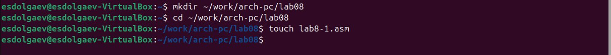{#fig:002 width=70%}

При реализации циклов в NASM с использованием инструкции loop необходимо помнить о том, что эта инструкция использует регистр `ecx` в качестве счетчика и на каждом шаге уменьшает его значение на единицу. В качестве примера рассмотрим программу, которая выводит значение регистра `ecx`.

Введём в файл lab8-1.asm текст программы из листинга 8.1. Создадим исполняемый файл и проверим его работу(рис. [-@fig:003]).

Текст программы:
```nasm
%include 'in_out.asm'
SECTION .data
msg1 db 'Введите N: ',0h
SECTION .bss
N: resb 10
SECTION .text
global _start
_start:
; ----- Вывод сообщения 'Введите N: '
mov eax,msg1
call sprint
; ----- Ввод 'N'
mov ecx, N
mov edx, 10
call sread
; ----- Преобразование 'N' из символа в число
mov eax,N
call atoi
mov [N],eax
; ------ Организация цикла
mov ecx,[N] ; Счетчик цикла, `ecx=N`
label:
mov [N],ecx
mov eax,[N]
call iprintLF ; Вывод значения `N`
loop label ; `ecx=ecx-1` и если `ecx` не '0'
; переход на `label`
call quit
```

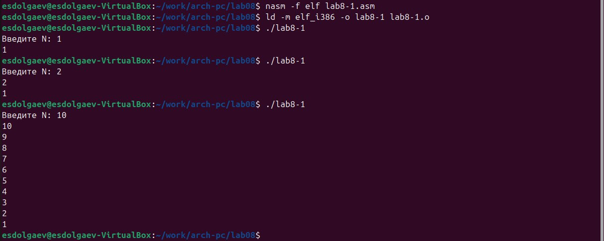{#fig:003 width=70%}

Данный пример показывает, что использование регистра ecx в теле цилка `loop` может привести к некорректной работе программы. Изменим текст программы добавив изменение значение регистра `ecx` в цикле. Создадим исполняемый файл и проверим его работу(рис. [-@fig:004], [-@fig:005]).

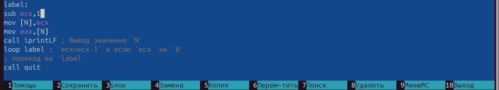{#fig:004 width=70%}

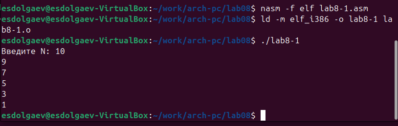{#fig:005 width=70%}

Регист `ecx` принимает только нечётные значения и число проходов цикла не соответствует введённому N.

Для использования регистра `ecx` в цикле и сохранения корректности работы программы можно использовать стек. Внесите изменения в текст программы добавив команды `push` и `pop` (добавления в стек и извлечения из стека) для сохранения значения счетчика цикла `loop`. Создадим исполняемый файл и проверим его работу(рис. [-@fig:006], [-@fig:007]). 

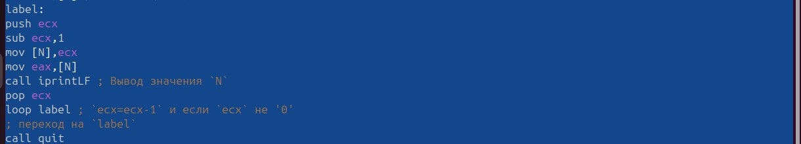{#fig:006 width=70%}

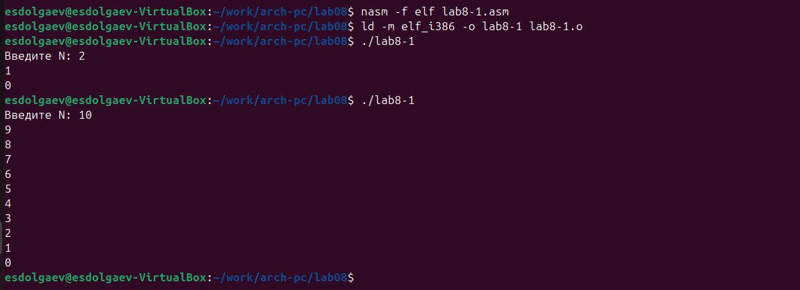{#fig:007 width=70%}

В этом случае количесто проходов цикла соответствует введённому N.

Создайте файл `lab8-2.asm` в каталоге `~/work/arch-pc/lab08` и введите в него текст программы(рис. [-@fig:008]).

Текст программы:

```nasm
%include 'in_out.asm'
SECTION .text
global _start
_start:
pop ecx ; Извлекаем из стека в `ecx` количество
; аргументов (первое значение в стеке)
pop edx ; Извлекаем из стека в `edx` имя программы
; (второе значение в стеке)
sub ecx, 1 ; Уменьшаем `ecx` на 1 (количество
; аргументов без названия программы)
next:
cmp ecx, 0 ; проверяем, есть ли еще аргументы
jz _end ; если аргументов нет выходим из цикла
; (переход на метку `_end`)
pop eax ; иначе извлекаем аргумент из стека
call sprintLF ; вызываем функцию печати
loop next ; переход к обработке следующего
; аргумента (переход на метку `next`)
_end:
call quit
```

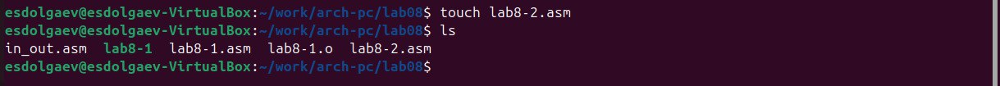{#fig:008 width=70%}

Создадим исполняемый файл и проверим его работу(рис. [-@fig:009]).

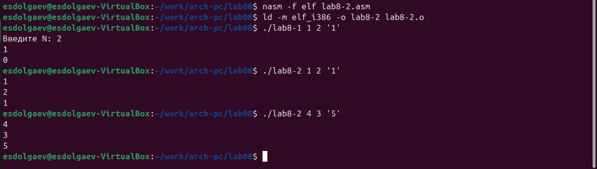{#fig:009 width=70%}

Программа обработала 3 аргумента.

Рассмотрим еще один пример программы которая выводит сумму чисел, которые передаются в программу как аргументы. Создадим файл `lab8-3.asm` в каталоге `~/work/arch-pc/lab08` и введём в него текст программы.

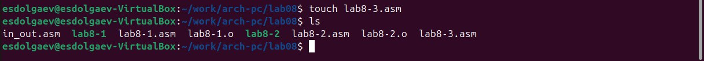{#fig:010 width=70%}

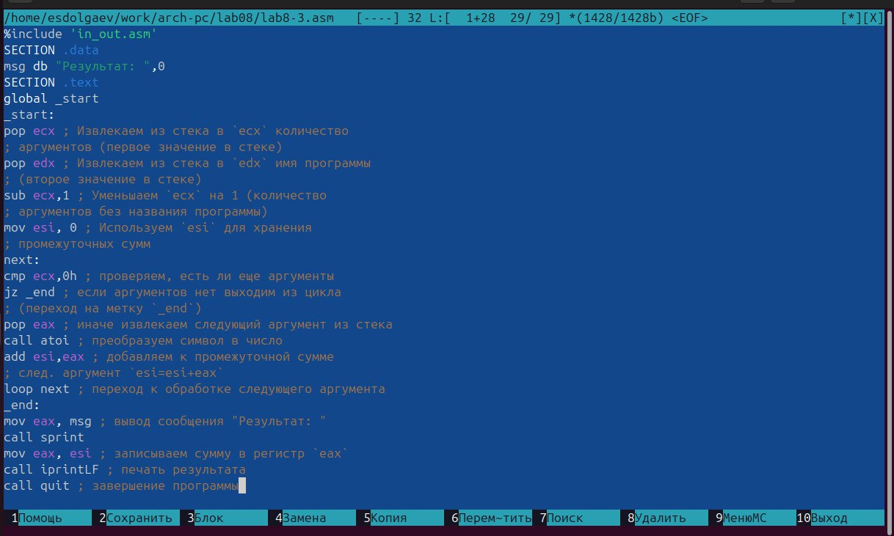{#fig:011 width=70%}

Создадим исполняемый файл и проверим его работу(рис. [-@fig:012]).

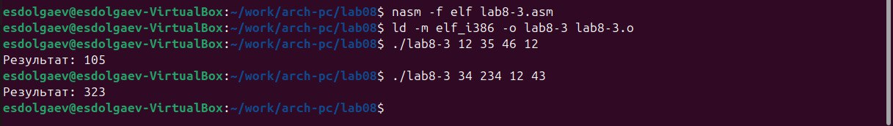{#fig:012 width=70%}

Изменим текст программы для вычисления произведения аргументов командной строки. Создадим исполняемый файл и проверим его работу(рис. [-@fig:013], [-@fig:014]).

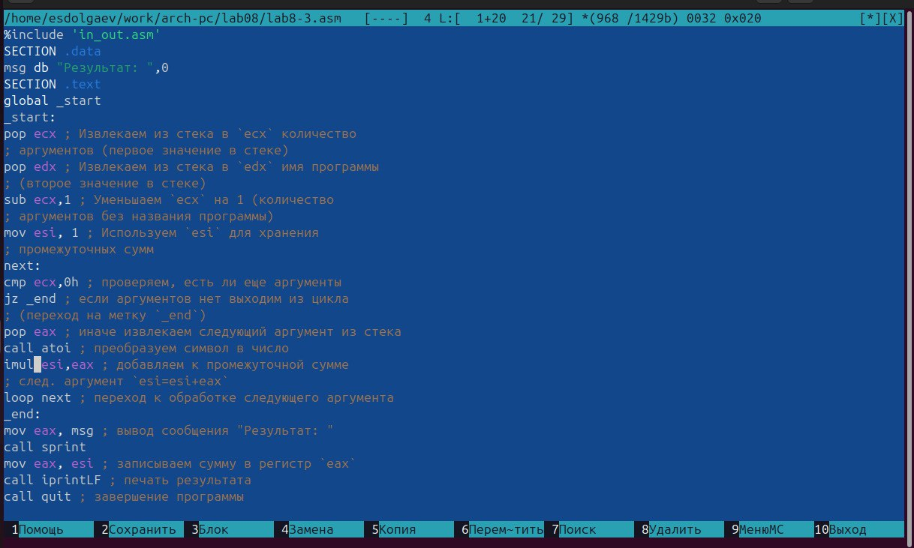{#fig:013 width=70%}

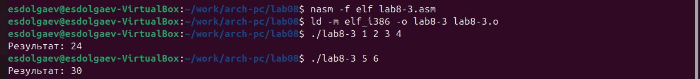{#fig:014 width=70%}

## Задание для самостоятельной работы

Введём текст программы в созданный файл, создадим исполняемый файл и проверим его работу(рис. [-@fig:015], [-@fig:016]).

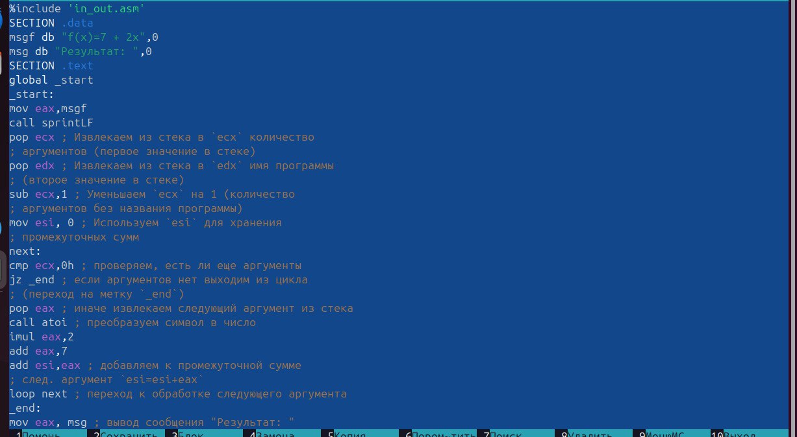{#fig:015 width=70%}

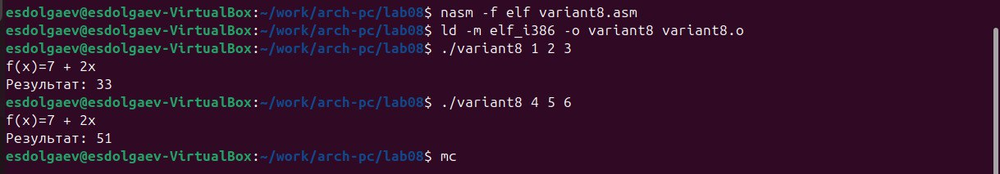{#fig:016 width=70%}

# Выводы

В ходе выполнения лабораторной работы я приобрёл навыки написания программ с использованием циклов и обработкой аргументов командной строки.

# Список литературы{.unnumbered}

::: {#refs}
:::
