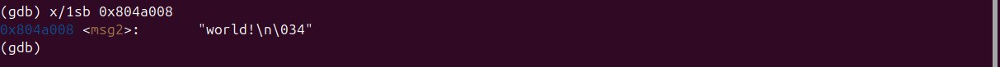
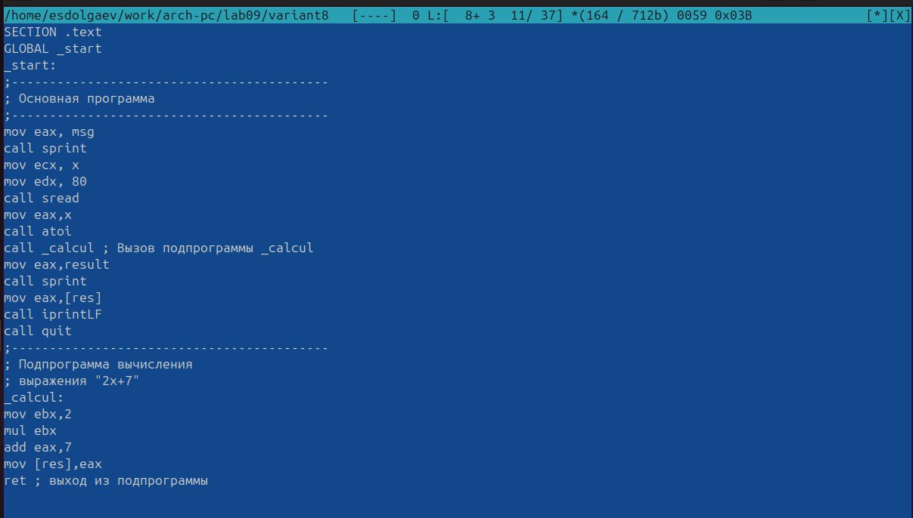
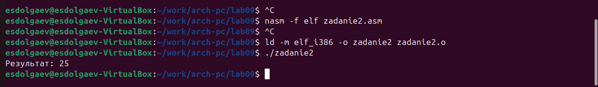

---
## Front matter
title: "Отчёт по лаборатоной работе №9"
subtitle: "*Дисциплина: Архитектура компьютера"
author: "Долгаев Евгений Сергеевич"

## Generic otions
lang: ru-RU
toc-title: "Содержание"

## Bibliography
bibliography: bib/cite.bib
csl: pandoc/csl/gost-r-7-0-5-2008-numeric.csl

## Pdf output format
toc: true # Table of contents
toc-depth: 2
lof: true # List of figures
lot: true # List of tables
fontsize: 12pt
linestretch: 1.5
papersize: a4
documentclass: scrreprt
## I18n polyglossia
polyglossia-lang:
  name: russian
  options:
	- spelling=modern
	- babelshorthands=true
polyglossia-otherlangs:
  name: english
## I18n babel
babel-lang: russian
babel-otherlangs: english
## Fonts
mainfont: IBM Plex Serif
romanfont: IBM Plex Serif
sansfont: IBM Plex Sans
monofont: IBM Plex Mono
mathfont: STIX Two Math
mainfontoptions: Ligatures=Common,Ligatures=TeX,Scale=0.94
romanfontoptions: Ligatures=Common,Ligatures=TeX,Scale=0.94
sansfontoptions: Ligatures=Common,Ligatures=TeX,Scale=MatchLowercase,Scale=0.94
monofontoptions: Scale=MatchLowercase,Scale=0.94,FakeStretch=0.9
mathfontoptions:
## Biblatex
biblatex: true
biblio-style: "gost-numeric"
biblatexoptions:
  - parentracker=true
  - backend=biber
  - hyperref=auto
  - language=auto
  - autolang=other*
  - citestyle=gost-numeric
## Pandoc-crossref LaTeX customization
figureTitle: "Рис."
tableTitle: "Таблица"
listingTitle: "Листинг"
lofTitle: "Список иллюстраций"
lotTitle: "Список таблиц"
lolTitle: "Листинги"
## Misc options
indent: true
header-includes:
  - \usepackage{indentfirst}
  - \usepackage{float} # keep figures where there are in the text
  - \floatplacement{figure}{H} # keep figures where there are in the text
---

# Цель работы

Приобретение навыков написания программ с использованием подпрограмм. Знакомство с методами отладки при помощи GDB и его основными возможностями.

# Задание

1) Выполнение лабораторной работы
	1) Реализация подпрограмм в NASM
	2) Отладка программам с помощью GDB
2) Задание для самостоятельной работы

# Теоретическое введение

## Понятие об отладке

*Отладка* — это процесс поиска и исправления ошибок в программе. В общем случае его можно разделить на четыре этапа:

- обнаружение ошибки;
- поиск её местонахождения;
- определение причины ошибки;
- исправление ошибки.

Можно выделить следующие типы ошибок:

- синтаксические ошибки — обнаруживаются во время трансляции исходного кода и вызваны нарушением ожидаемой формы или структуры языка;
- семантические ошибки — являются логическими и приводят к тому, что программа запускается, отрабатывает, но не даёт желаемого результата;
- ошибки в процессе выполнения — не обнаруживаются при трансляции и вызывают прерывание выполнения программы (например, это ошибки, связанные с переполнением или делением на ноль).

Второй этап — поиск местонахождения ошибки. Некоторые ошибки обнаружить довольно трудно. Лучший способ найти место в программе, где находится ошибка, это разбить программу на части и произвести их отладку отдельно друг от друга.

Третий этап — выяснение причины ошибки. После определения местонахождения ошибки обычно проще определить причину неправильной работы программы.

Последний этап — исправление ошибки. После этого при повторном запуске программы, может обнаружиться следующая ошибка, и процесс отладки начнётся заново.

## Методы отладки

Наиболее часто применяют следующие методы отладки:

- создание точек контроля значений на входе и выходе участка программы (например, вывод промежуточных значений на экран — так называемые диагностические сообщения);
- использование специальных программ-отладчиков.

Отладчики позволяют управлять ходом выполнения программы, контролировать и изменять данные. Это помогает быстрее найти место ошибки в программе и ускорить её исправление. Наиболее популярные способы работы с отладчиком — это использование точек останова и выполнение программы по шагам.

*Пошаговое выполнение* — это выполнение программы с остановкой после каждой строчки, чтобы программист мог проверить значения переменных и выполнить другие действия.

*Точки останова* — это специально отмеченные места в программе, в которых программаотладчик приостанавливает выполнение программы и ждёт команд. Наиболее популярные виды точек останова:

- Breakpoint — точка останова (остановка происходит, когда выполнение доходит до определённой строки, адреса или процедуры, отмеченной программистом);
- Watchpoint — точка просмотра (выполнение программы приостанавливается, если программа обратилась к определённой переменной: либо считала её значение, либо изменила его).

Точки останова устанавливаются в отладчике на время сеанса работы с кодом программы, т.е. они сохраняются до выхода из программы-отладчика или до смены отлаживаемой программы.

## Основные возможности отладчика GDB

GDB (GNU Debugger — отладчик проекта GNU) [1] работает на многих UNIX-подобных системах и умеет производить отладку многих языков программирования. GDB предлагает обширные средства для слежения и контроля за выполнением компьютерных программ. Отладчик не содержит собственного графического пользовательского интерфейса и использует стандартный текстовый интерфейс консоли. Однако для GDB существует несколько сторонних графических надстроек, а кроме того, некоторые интегрированные среды разработки используют его в качестве базовой подсистемы отладки.

Отладчик GDB (как и любой другой отладчик) позволяет увидеть, что происходит «внутри» программы в момент её выполнения или что делает программа в момент сбоя.

GDB может выполнять следующие действия:

- начать выполнение программы, задав всё, что может повлиять на её поведение;
- остановить программу при указанных условиях;
- исследовать, что случилось, когда программа остановилась;
- изменить программу так, чтобы можно было поэкспериментировать с устранением эффектов одной ошибки и продолжить выявление других.

## Запуск отладчика GDB; выполнение программы; выход

Синтаксис команды для запуска отладчика имеет следующий вид:

```nasm
gdb [опции] [имя_файла | ID процесса]
```

После запуска gdb выводит текстовое сообщение — так называемое «nice GDB logo». В следующей строке появляется приглашение (gdb) для ввода команд.

Далее приведён список некоторых команд GDB.

Команда run (сокращённо r) — запускает отлаживаемую программу в оболочке GDB.

Если точки останова не были установлены, то программа выполняется и выводятся сообщения:

```nasm
(gdb) run
Starting program: test
Program exited normally.
(gdb)
```

Если точки останова были заданы, то отладчик останавливается на соответствующей команде и выдаёт номер точки останова, адрес и дополнительную информацию — текущую строку, имя процедуры, и др.

Команда kill (сокращённо k) прекращает отладку программы, после чего следует вопрос о прекращении процесса отладки:

```nasm
Kill the program being debugged? (y or n) y
```

Если в ответ введено y (то есть «да»), отладка программы прекращается. Командой run её можно начать заново, при этом все точки останова (breakpoints), точки просмотра (watchpoints) и точки отлова (catchpoints) сохраняются.

Для выхода из отладчика используется команда quit (или сокращённо q):

```nasm
(gdb) q
```

## Дизассемблирование программы

Если есть файл с исходным текстом программы, а в исполняемый файл включена информация о номерах строк исходного кода, то программу можно отлаживать, работая в отладчике непосредственно с её исходным текстом. Чтобы программу можно было отлаживать на уровне строк исходного кода, она должна быть откомпилирована с ключом -g.

Посмотреть дизассемблированный код программы можно с помощью команды disassemble <метка/адрес>:

```nasm
(gdb) disassemble _start
```

Существует два режима отображения синтаксиса машинных команд: режим Intel, используемый в том числе в NASM, и режим ATT (значительно отличающийся внешне). По умолчанию в дизассемблере GDB принят режим ATT. Переключиться на отображение команд с привычным Intel’овским синтаксисом можно, введя команду set disassembly-flavor intel

## Точки останова

Установить точку останова можно командой break (кратко b). Типичный аргумент этой команды — место установки. Его можно задать как имя метки или как адрес. Чтобы не было путаницы с номерами, перед адресом ставится «звёздочка»:

```nasm
(gdb) break *<адрес>
(gdb) b <метка>
```

Информацию о всех установленных точках останова можно вывести командой info (кратко i):

```nasm
(gdb) info breakpoints
(gdb) i b
```

Для того чтобы сделать неактивной какую-нибудь ненужную точку останова, можно воспользоваться командой disable:

```nasm
disable breakpoint <номер точки останова>
```

Обратно точка останова активируется командой enable:

```nasm
enable breakpoint <номер точки останова>
```
Если же точка останова в дальнейшем больше не нужна, она может быть удалена с помощью команды delete:

```nasm
(gdb) delete breakpoint <номер точки останова>
```

Ввод этой команды без аргумента удалит все точки останова.

Информацию о командах этого раздела можно получить, введя

```nasm
help breakpoints
```

## Пошаговая отладка

Для продолжения остановленной программы используется команда continue (c) (gdb) с [аргумент]. Выполнение программы будет происходить до следующей точки останова. В качестве аргумента может использоваться целое число N, которое указывает отладчику проигнорировать N − 1 точку останова (выполнение остановится на N-й точке).

Команда stepi (кратко sI) позволяет выполнять программу по шагам, т.е. данная команда выполняет ровно одну инструкцию:

```nasm
(gdb) si [аргумент]
```

При указании в качестве аргумента целого числа N отладчик выполнит команду step N раз при условии, что не будет точек останова или выполнение программы не прервётся по другим причинам.

Команда nexti (или ni) аналогична stepi, но вызов процедуры (функции) трактуется отладчиком как одна инструкция:

```nasm
(gdb) ni [аргумент]
```

Информацию о командах этого раздела можно получить, введя

```nasm
(gdb) help running
```

## Работа с данными программы в GDB

Как уже упоминалось, отладчик может показывать содержимое ячеек памяти и регистров, а при необходимости позволяет вручную изменять значения регистров и переменных.

Посмотреть содержимое регистров можно с помощью команды info registers (или ir):

```nasm
(gdb) info registers
```

Для отображения содержимого памяти можно использовать команду x/NFU <адрес>, выдаёт содержимое ячейки памяти по указанному адресу. NFU задает формат, в котором выводятся данные (см. таблицу [-@tbl:1]).

: Формат отображения данных команды x {#tbl:1}

| Значение | Описание |
|-|-|-|
| N | Десятичное число | Счётчик повторений. Определяет, сколько ячеек памяти отобразить (считая в единицах), по умолчанию 1. |
| F | Формат отображения |  |
|   | s | строка оканцивающаяся нулём |
|   | x | машинная инструкция |
|   | i | шестнадцатеричное число |
|   | a | адрес |
| U | Pазмер отображаемых ячеек памяти |  |
|   | b | байт |
|   | h | полуслово, 2 байта |
|   | w | машинное слово, 4 байта(значение по умолчанию) |
|   | g | длинное слово, 8 байт |

Например, x/4uh 0x63450 — это запрос на вывод четырёх полуслов (h) из памяти в формате беззнаковых десятичных целых (u), начиная с адреса 0x63450.

Чтобы посмотреть значения регистров используется команда print /F <val> (сокращенно p). Перед именем регистра обязательно ставится префикс $. Например, команда p/x $ecx выводит значение регистра в шестнадцатеричном формате.

Изменить значение для регистра или ячейки памяти можно с помощью команды set, задав ей в качестве аргумента имя регистра или адрес. При этом перед именем регистра ставится префикс $, а перед адресом нужно указать в фигурных скобках тип данных (размер сохраняемого значения; в качестве типа данных можно использовать типы языка Си).

Справку о любой команде gdb можно получить, введя

```nasm
(gdb) help [имя_команды]
```

## Понятие подпрограммы

Подпрограмма — это, как правило, функционально законченный участок кода, который можно многократно вызывать из разных мест программы. В отличие от простых переходов из подпрограмм существует возврат на команду, следующую за вызовом.

Если в программе встречается одинаковый участок кода, его можно оформить в виде подпрограммы, а во всех нужных местах поставить её вызов. При этом подпрограмма будет содержаться в коде в одном экземпляре, что позволит уменьшить размер кода всей программы.

### Инструкция call и инструкция ret

Для вызова подпрограммы из основной программы используется инструкция call, которая заносит адрес следующей инструкции в стек и загружает в регистр eip адрес соответствующей подпрограммы, осуществляя таким образом переход. Затем начинается выполнение подпрограммы, которая, в свою очередь, также может содержать подпрограммы.

Подпрограмма завершается инструкцией ret, которая извлекает из стека адрес, занесённый туда соответствующей инструкцией call, и заносит его в eip. После этого выполнение основной программы возобновится с инструкции, следующей за инструкцией call.

Подпрограмма может вызываться как из внешнего файла, так и быть частью основной программы.
Основные моменты выполнения подпрограммы иллюстрируются на рис. [-@fig:001].

{#fig:001 width=70%}

Важно помнить, что если в подпрограмме занести что-то в стек и не извлечь, то на вершине стека окажется не адрес возврата и это приведёт к ошибке выхода из подпрограммы. Кроме того, надо помнить, что подпрограмма без команды возврата не вернётся в точку вызова, а будет выполнять следующий за подпрограммой код, как будто он является её продолжением.


# Выполнение лабораторной работы

Создим каталог для выполнения лабораторной работы № 9, перейдём в него и со-
здим файл lab09-1.asm(рис. [-@fig:002])

{#fig:002 width=70%}

В качестве примера рассмотрим программу вычисления арифметического выражения f(x) = 2x + 7 с помощью подпрограммы _calcul. В данном примере x вводится с клавиатуры, а само выражение вычисляется в подпрограмме.

Введём в файл lab09-1.asm текст программы. Создим исполняемый файл и проверим его работу(рис. [-@fig:003], [-@fig:004]).

{#fig:003 width=70%}

{#fig:004 width=70%}

Изменим текст программы, добавив подпрограмму _subcalcul в подпрограмму _calcul, для вычисления выражения f(g(x)), где x вводится с клавиатуры, f(x) = 2x + 7, g(x) = 3x − 1. Т.е. x передается в подпрограмму _calcul из нее в подпрограмму _subcalcul, где вычисляется выражение g(x), результат возвращается в _calcul и вычисляется выражение f(g(x)). Результат возвращается в основную программу для вывода результата на экран(рис. [-@fig:005], [-@fig:006]).

{#fig:005 width=70%}

{#fig:006 width=70%}

Создим файл lab09-2.asm с текстом программы. (Программа печати сообщения Hello world!)(рис. [-@fig:007], [-@fig:008]):

{#fig:007 width=70%}

{#fig:008 width=70%}

Получим исполняемый файл. Для работы с GDB в исполняемый файл необходимо добавить отладочную информацию, для этого трансляцию программ необходимо проводить с ключом ‘-g’(рис. [-@fig:009]).

{#fig:009 width=70%}

Загрузим исполняемый файл в отладчик gdb(рис. [-@fig:010]):

{#fig:010 width=70%}

Проверим работу программы, запустив ее в оболочке GDB с помощью команды run (сокращённо r)(рис. [-@fig:011]):

{#fig:011 width=70%}

Для более подробного анализа программы установим брейкпоинт на метку _start, с которой начинается выполнение любой ассемблерной программы, и запустим её(рис. [-@fig:012]).

{#fig:012 width=70%}

Посмотрим дисассимилированный код программы с помощью команды disassemble начиная с метки _start(рис. [-@fig:013]).

{#fig:013 width=70%}

Переключимся на отображение команд с Intel’овским синтаксисом, введя команду set disassembly-flavor intel(рис. [-@fig:014]).

{#fig:014 width=70%}

Имена регистров и их значения написаны в обратном порядке и без спецсимволов
Включим режим псевдографики для более удобного анализа программы.

На предыдущих шагах была установлена точка останова по имени метки (_start). Про-
верьте это с помощью команды info breakpoints (кратко i b)(рис. [-@fig:015]).

{#fig:015 width=70%}

Установим еще одну точку останова по адресу инструкции. Адрес инструкции можно увидеть в средней части экрана в левом столбце соответствующей инструкции(рис. [-@fig:016]).

{#fig:016 width=70%}

Выполните 5 инструкций с помощью команды stepi (или si)(рис. [-@fig:017]).

{#fig:017 width=70%}

Посмотрим содержимое регистров с помощью команды info registers(или i r)(рис. [-@fig:018]).

{#fig:018 width=70%}

С помощью команды x &<имя переменной> также можно посмотреть содержимое переменной. Посмотрите значение переменной msg1 по имени(рис. [-@fig:019]).

{#fig:019 width=70%}

Посмотрим значение переменной msg2 по адресу. Адрес переменной можно определить
по дизассемблированной инструкции(рис. [-@fig:020]).

{#fig:020 width=70%}

Изменить значение для регистра или ячейки памяти можно с помощью команды set, задав ей в качестве аргумента имя регистра или адрес. При этом перед именем регистра ставится префикс $, а перед адресом нужно указать в фигурных скобках тип данных (размер сохраняемого значения; в качестве типа данных можно использовать типы языка Си).

Изменим первый символ переменной msg1(рис. [-@fig:021]).

{#fig:021 width=70%}

Заменим символ во второй переменной msg2(рис. [-@fig:022]).

{#fig:022 width=70%}

Выведем в различных форматах значение регистра edx(рис. [-@fig:023]).

{#fig:023 width=70%}

С помощью команды set изменим значение регистра ebx(рис. [-@fig:024], [-@fig:025]):

{#fig:024 width=70%}

{#fig:025 width=70%}

Скопируем файл lab8-2.asm, созданный при выполнении лабораторной работы №8,
с программой выводящей на экран аргументы командной строки в файл с
именем lab09-3.asm(рис. [-@fig:026]):

{#fig:026 width=70%}

Создайте исполняемый файл. Для загрузки в gdb программы с аргументами необходимо использовать ключ --args.
Загрузите исполняемый файл в отладчик, указав аргументы(рис. [-@fig:027]).

{#fig:027 width=70%}

Установим точку останова перед первой инструкцией в программе и запустим ее(рис. [-@fig:028]).

{#fig:028 width=70%}

Адрес вершины стека храниться в регистре esp и по этому адресу располагается число равное количеству аргументов командной строки (включая имя программы)(рис. [-@fig:029]):

{#fig:029 width=70%}

Посмотрите остальные позиции стека – по адесу [esp+4] располагается адрес в памяти где находиться имя программы, по адесу [esp+8] храниться адрес первого аргумента, по аресу [esp+12] – второго и т.д(рис. [-@fig:030]).

{#fig:030 width=70%}

# Задание для самостоятельной работы

## Задание 1

Преобразуем программу из лабораторной работы №8 (Задание №1 для самостоятельной работы), реализовав вычисление значения функции как подпрограмму(рис. [-@fig:031], [-@fig:032]).

{#fig:031 width=70%}

{#fig:032 width=70%}

## Задание 2

Введём созданный файл текст программы и убедимся, что она работает неправильно(рис. [-@fig:033], [-@fig:034]).

{#fig:033 width=70%}

{#fig:034 width=70%}

С помощью отладчика GDB можно прийти к вывоводу: имена регистров в агрументах к командам mov, add, mull и т.д. указаны неправильно.

Исправим код программы создадим исполняемый файл и проверим его работы(рис. [-@fig:035], [-@fig:036]).

{#fig:035 width=70%}

{#fig:036 width=70%}

# Выводы

В ходе выполнения лабораторной работы я приобрёл навыки написания программ с использованием подпрограмм и познакомился с методами отладки при помощи GDB и его основными возможностями.

# Список литературы{.unnumbered}

::: {#refs}
:::
