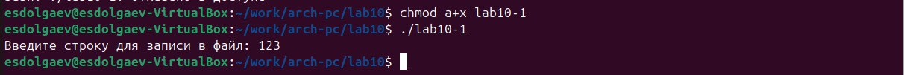

---
## Front matter
title: "Отчёт по лабораторной работе №10"
subtitle: "*Дисциплина: Архитектура компьютера*"
author: "Долгаев Евгений Сергеевич"

## Generic otions
lang: ru-RU
toc-title: "Содержание"

## Bibliography
bibliography: bib/cite.bib
csl: pandoc/csl/gost-r-7-0-5-2008-numeric.csl

## Pdf output format
toc: true # Table of contents
toc-depth: 2
lof: true # List of figures
lot: true # List of tables
fontsize: 12pt
linestretch: 1.5
papersize: a4
documentclass: scrreprt
## I18n polyglossia
polyglossia-lang:
  name: russian
  options:
	- spelling=modern
	- babelshorthands=true
polyglossia-otherlangs:
  name: english
## I18n babel
babel-lang: russian
babel-otherlangs: english
## Fonts
mainfont: IBM Plex Serif
romanfont: IBM Plex Serif
sansfont: IBM Plex Sans
monofont: IBM Plex Mono
mathfont: STIX Two Math
mainfontoptions: Ligatures=Common,Ligatures=TeX,Scale=0.94
romanfontoptions: Ligatures=Common,Ligatures=TeX,Scale=0.94
sansfontoptions: Ligatures=Common,Ligatures=TeX,Scale=MatchLowercase,Scale=0.94
monofontoptions: Scale=MatchLowercase,Scale=0.94,FakeStretch=0.9
mathfontoptions:
## Biblatex
biblatex: true
biblio-style: "gost-numeric"
biblatexoptions:
  - parentracker=true
  - backend=biber
  - hyperref=auto
  - language=auto
  - autolang=other*
  - citestyle=gost-numeric
## Pandoc-crossref LaTeX customization
figureTitle: "Рис."
tableTitle: "Таблица"
listingTitle: "Листинг"
lofTitle: "Список иллюстраций"
lotTitle: "Список таблиц"
lolTitle: "Листинги"
## Misc options
indent: true
header-includes:
  - \usepackage{indentfirst}
  - \usepackage{float} # keep figures where there are in the text
  - \floatplacement{figure}{H} # keep figures where there are in the text
---

# Цель работы

Приобретение навыков написания программ для работы с файлами.

# Задание

1) Порядок выполнения лабораторной работы
2) Задание для самостоятельной работы

# Теоретическое введение

## Права доступа к файлам

ОС GNU/Linux является многопользовательской операционной системой. И для обеспечения защиты данных одного пользователя от действий других пользователей существуют специальные механизмы разграничения доступа к файлам. Кроме ограничения доступа, данный механизм позволяет разрешить другим пользователям доступ данным для совместной работы.

Права доступа определяют набор действий (чтение, запись, выполнение), разрешённых для выполнения пользователям системы над файлами. Для каждого файла пользователь может входить в одну из трех групп: владелец, член группы владельца, все остальные. Для каждой из этих групп может быть установлен свой набор прав доступа. Владельцем файла является его создатель. Для предоставления прав доступа другому пользователю или другой группе командой

```nasm
chown [ключи] <новый_пользователь>[:новая_группа] <файл>
```

или

```nasm
chgrp [ключи] < новая_группа > <файл>
```

Набор прав доступа задается тройками битов и состоит из прав на чтение, запись и исполнение файла. В символьном представлении он имеет вид строк rwx, где вместо любого символа может стоять дефис. Всего возможно 8 комбинаций, приведенных в таблице [-@tbl:1]. Буква означает наличие права (установлен в единицу второй бит триады r — чтение, первый бит w — запись, нулевой бит х — исполнение), а дефис означает отсутствие права (нулевое значение соответствующего бита). Также права доступа могут быть представлены как восьмеричное число. Так, права доступа rw- (чтение и запись, без исполнения) понимаются как три двоичные цифры 110 или как восьмеричная цифра 6.

: Двоичный, буквенный и восмеричный способ записи триады прав доступа {#tbl:1}

| Двоичный | Буквенный | Восьмиричный |
|-|-|-|
| 111 | rwx | 7 |
| 110 | rw- | 6 |
| 101 | r-x | 5 |
| 100 | r-- | 4 |
| 011 | -wx | 3 |
| 010 | -w- | 2 |
| 001 | --x | 1 |
| 000 | --- | 0 |

Полная строка прав доступа в символьном представлении имеет вид:

> <права_владельца> <права_группы> <права_остальных>

Так, например, права rwx r-x --x выглядят как двоичное число 111 101 001, или восьмеричное 751.

Свойства (атрибуты) файлов и каталогов можно вывести на терминал с помощью команды ls с ключом -l. Так например, чтобы узнать права доступа к файлу README можно узнать с помощью следующей команды:

```nasm
$ls -l /home/debugger/README
-rwxr-xr-- 1 debugger users 0 Feb 14 19:08 /home/debugger/README
```

В первой колонке показаны текущие права доступа, далее указан владелец файла и группа:

{#fig:001 width=70%}

Тип файла определяется первой позицией, это может быть: каталог — d, обычный файл — дефис (-) или символьная ссылка на другой файл — l. Следующие 3 набора по 3 символа определяют конкретные права для конкретных групп: r — разрешено чтение файла, w — разрешена запись в файл; x — разрешено исполнение файл и дефис (-) — право не дано.

Для изменения прав доступа служит команда chmod, которая понимает как символьное, так и числовое указание прав. Для того чтобы назначить файлу /home/debugger/README права rw-r, то есть разрешить владельцу чтение и запись, группе только чтение, остальным пользователям — ничего:

```nasm
$chmod 640 README # 110 100 000 == 640 == rw-r-----
$ls -l README
-rw-r 1 debugger users 0 Feb 14 19:08 /home/debugger/README
```

В символьном представлении есть возможность явно указывать какой группе какие права
необходимо добавить, отнять или присвоить. Например, чтобы добавить право на исполне-
ние файла README группе и всем остальным:

```nasm
$chmod go+x README
$ls -l README
-rw-r-x--x 1 debugger users 0 Feb 14 19:08 /home/debugger/README
```

Формат символьного режима:

```nasm
chmod <категория><действие><набор_прав><файл>
```

Возможные значения аргументов команды представлены в таблице [-@tbl:2].

: Возможные значения аргументов команды chmod {#tbl:2}

| Категория | Обозначение | Значение |
|-|-|-|
| Принадлежность | u | Владелец |
|  | g | Группа владельца |
|  | o | Прочие пользователи |
|  | a | Все пользователи, то есть «а» эквивалентно «ugo» |
| Действие | + | Добавить набор прав |
|  | - | Отменить набор прав |
|  | + | Назначить набор прав |
| Право | r | Право на чтение |
|  | w | Право на запись |
|  | x | Право на исполнение |

## Работа с файлами средствами Nasm

В операционной системе Linux существуют различные методы управления файлами, например, такие как создание и открытие файла, только для чтения или для чтения и записи, добавления в существующий файл, закрытия и удаления файла, предоставление прав доступа.

Обработка файлов в операционной системе Linux осуществляется за счет использования определенных системных вызовов. Для корректной работы и доступа к файлу при его открытии или создании, файлу присваивается уникальный номер (16-битное целое число) – дескриптор файла.

В таблице [-@tbl:3] приведены системные вызовы для обработки файлов.

: Cистемные вызовы для обработки файлов {#tbl:3}

| Имя системного вызова | eax | ebx | ecx | edx |
|-|-|-|-|-|
| sys_read | 3 | дескриптор файла | адрес в памяти | количество байтов |
| sys_write | 4 | дескриптор файла | строка | количество байтов |
| sys_open | 5 | имя файла | режим доступа к файлу | права доступа к файлу |
| sys_close | 6 | дескриптор файла |-|-|
| sys_creat | 8 | имя файла |права доступа к файлу |-|
| sys_unlink | 10 | имя файла |-|-|
| sys_lseek | 19 | имя файла | значение смещения в байтах | позиция для смещения |

Общий алгоритм работы с системными вызовами в Nasm можно представить в следующем виде:

1. Поместить номер системного вызова в регистр EAX;
2. Поместить аргументы системного вызова в регистрах EBX, ECX и EDX;
3. Вызов прерывания (int 80h);
4. Результат обычно возвращается в регистр EAX.

### Открытие и создание файла

Для создания и открытия файла служит системный вызов sys_creat, который использует следующие аргументы: права доступа к файлу в регистре ECX, имя файла в EBX и номер системного вызова sys_creat (8) в EAX.

```nasm
mov ecx, 0777o ; установка прав доступа
mov ebx, filename ; имя создаваемого файла
mov eax, 8 ; номер системного вызова `sys_creat`
int 80h ; вызов ядра
```

Для открытия существующего файла служит системный вызов sys_open, который использует следующие аргументы: права доступа к файлу в регистре EDX, режим доступа к файлу в регистр ECX, имя файла в EBX и номер системного вызова sys_open (5) в EAX.

Среди режимов доступа к файлам чаще всего используются:

- (0) – O_RDONLY (открыть файл в режиме только для чтения);
- (1) – O_WRONLY – (открыть файл в режиме только записи);
- (2) – O_RDWR – (открыть файл в режиме чтения и записи).

Системный вызов возвращает файловый дескриптор открытого файла в регистр EAX. В случае ошибки, код ошибки также будет находиться в регистре EAX.

```nasm
mov ecx, 0 ; режим доступа (0 - только чтение)
mov ebx, filename ; имя открываемого файла
mov eax, 5 ; номер системного вызова `sys_open`
int 80h ; вызов ядра
```

### Запись в файл
Для записи в файл служит системный вызов sys_write, который использует следующие аргументы: количество байтов для записи в регистре EDX, строку содержимого для записи ECX, файловый дескриптор в EBX и номер системного вызова sys_write (4) в EAX. Системный вызов возвращает фактическое количество записанных байтов в регистр EAX.

В случае ошибки, код ошибки также будет находиться в регистре EAX.

Прежде чем записывать в файл, его необходимо создать или открыть, что позволит получить дескриптор файла.

```nasm
mov ecx, 0777o ; Создание файла.
mov ebx, filename ; в случае успешного создания файла,
mov eax, 8 ; в регистр eax запишется дескриптор файла
int 80h
mov edx, 12 ; количество байтов для записи
mov ecx, msg ; адрес строки для записи в файл
mov ebx, eax ; дескриптор файла
mov eax, 4 ; номер системного вызова `sys_write`
int 80h ; вызов ядра
```

### Чтение файла

Для чтения данных из файла служит системный вызов sys_read, который использует следующие аргументы: количество байтов для чтения в регистре EDX, адрес в памяти для записи прочитанных данных в ECX, файловый дескриптор в EBX и номер системного вызова sys_read (3) в EAX. Как и для записи, прежде чем читать из файла, его необходимо открыть, что позволит получить дескриптор файла.

```nasm
mov ecx, 0 ; Открытие файла.
mov ebx, filename ; в случае успешного открытия файла,
mov eax, 5 ; в регистр EAX запишется дескриптор файла
int 80h
mov edx, 12 ; количество байтов для чтения
mov ecx, fileCont ; адрес в памяти для записи прочитанных данных
mov ebx, eax ; дескриптор файла
mov eax, 3 ; номер системного вызова `sys_read`
int 80h ; вызов ядра
```

### Закрытие файла
Для правильного закрытия файла служит системный вызов sys_close, который использует один аргумент – дескриптор файла в регистре EBX. После вызова ядра происходит удаление дескриптора файла, а в случае ошибки, системный вызов возвращает код ошибки в регистр EAX.

```nasm
mov ecx, 0 ; Открытие файла.
mov ebx, filename ; в случае успешного открытия файла,
mov eax, 5 ; в регистр EAX запишется дескриптор файла
int 80h
mov ebx, eax ; дескриптор файла
mov eax, 6 ; номер системного вызова `sys_close`
int 80h ; вызов ядра
```

### Изменение содержимого файла
Для изменения содержимого файла служит системный вызов sys_lseek, который использует следующие аргументы: исходная позиция для смещения EDX, значение смещения в байтах в ECX, файловый дескриптор в EBX и номер системного вызова sys_lseek (19) в EAX. Значение смещения можно задавать в байтах. Значения обозначающие исходную позиции могут быть следующими:

- (0) – SEEK_SET (начало файла);
- (1) – SEEK_CUR (текущая позиция);
- (2) – SEEK_END (конец файла).

В случае ошибки, системный вызов возвращает код ошибки в регистр EAX.

```nasm
mov ecx, 1 ; Открытие файла (1 - для записи).
mov ebx, filename
mov eax, 5
int 80h
mov edx, 2 ; значение смещения -- конец файла
mov ecx, 0 ; смещение на 0 байт
mov ebx, eax ; дескриптор файла
mov eax, 19 ; номер системного вызова `sys_lseek`
int 80h ; вызов ядра
mov edx, 9 ; Запись в конец файла
mov ecx, msg ; строки из переменной `msg`
mov eax, 4
int 80h
```

### Удаление файла

Удаление файла осуществляется системным вызовом sys_unlink, который использует один аргумент – имя файла в регистре EBX.

```nasm
mov ebx, filename ; имя файла
mov eax, 10 ; номер системного вызова `sys_unlink`
int 80h ; вызов ядра
```

В качестве примера приведем программу, которая открывает существующий файл, записывает в него сообщение и закрывает файл.

```nasm
;--------------------------------
; Запись в файл строки введененой на запрос
;--------------------------------
%include 'in_out.asm'
SECTION .data
filename db 'readme.txt', 0h ; Имя файла
msg db 'Введите строку для записи в файл: ', 0h ; Сообщение
SECTION .bss
contents resb 255 ; переменная для вводимой строки
SECTION .text
global _start
_start:
; --- Печать сообщения `msg`
mov eax,msg
call sprint
; ---- Запись введеной с клавиатуры строки в `contents`
mov ecx, contents
mov edx, 255
call sread
; --- Открытие существующего файла (`sys_open`)
mov ecx, 2 ; открываем для записи (2)
mov ebx, filename
mov eax, 5
int 80h
; --- Запись дескриптора файла в `esi`
mov esi, eax
; --- Расчет длины введенной строки
mov eax, contents ; в `eax` запишется количество
call slen ; введенных байтов
; --- Записываем в файл `contents` (`sys_write`)
mov edx, eax
mov ecx, contents
mov ebx, esi
mov eax, 4
int 80h
; --- Закрываем файл (`sys_close`)
mov ebx, esi
mov eax, 6
int 80h
call quit
```

Результат работы программы:

```nasm
user@dk4n31:~$ nasm -f elf -g -l main.lst main.asm
user@dk4n31:~$ ld -m elf_i386 -o main main.o
user@dk4n31:~$ ./main
Введите строку для записи в файл: Hello world!
user@dk4n31:~$ ls -l
-rwxrwxrwx 1 user user 20 Jul 2 13:06 readme.txt
-rwxrwxrwx 1 user user 11152 Jul 2 13:05 main
-rwxrwxrwx 1 user user 1785 Jul 2 13:03 main.asm
-rwxrwxrwx 1 user user 22656 Jul 2 13:05 main.lst
-rwxrwxrwx 1 user user 4592 Jul 2 13:05 main.o
user@dk4n31:~$ cat readme.txt
Hello world!
user@dk4n31:~$
```
# Выполнение лабораторной работы

Создим каталог для программ лабораторной работы № 10, перейдём в него и создим файлы lab10-1.asm, readme-1.txt и readme-2.txt(рис. [-@fig:002]):

{#fig:002 width=70%}

Введём в файл lab10-1.asm текст программы (Программа записи в файл сообщения). Создим исполняемый файл и проверим его работу(рис. [-@fig:003], [-@fig:004], [-@fig:005]).

{#fig:003 width=70%}

{#fig:004 width=70%}

{#fig:005 width=70%}

С помощью команды chmod изменим права доступа к исполняемому файлу lab10-1, запретив его выполнение(рис. [-@fig:006]).

{#fig:006 width=70%}

Команда chmod a-x запрещает выполняться файлу lab10-1.

С помощью команды chmod изменим права доступа к файлу lab10-1.asm с исходным текстом программы, добавив права на исполнение(рис. [-@fig:007]).

{#fig:007 width=70%}

Команда chmod a+x запрещает выполняться файлу lab10-1.

Предоставим права доступа к файлу readme-1.txt представленные в символьном виде, а для файла readme-2.txt – в двочном виде. Проверим правильность выполнения с помощью команды ls -l(рис. [-@fig:008]).

{#fig:008 width=70%}

## Задание для самостоятельной работы

Напишем программу работающую по следующему алгоритму:

- Вывод приглашения “Как Вас зовут?”
- ввести с клавиатуры свои фамилию и имя
- создать файл с именем name.txt
- записать в файл сообщение “Меня зовут”
- дописать в файл строку введенную с клавиатуры
- закрыть файл

Создим исполняемый файл и проверим его работу. Проверим наличие файла и его содержимое с помощью команд ls и cat(рис. [-@fig:009], [-@fig:010]).

{#fig:009 width=70%}

{#fig:010 width=70%}

# Выводы

В ходе выполнения лабораторной работы я приобрёл навыки написания программ для работы с файлами.

# Список литературы{.unnumbered}

::: {#refs}
:::
